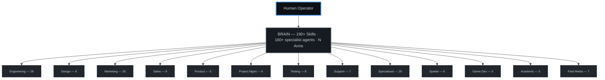

<p align="center">
  
</p>

> 🌍 This README is in English (the open-source lingua franca). Running an AI agent? Ask it to read this in your language — eating our own dog food. 🐙

# Octorato

> *an Octorato (n.) — an organic, file-native AI agent: one brain, many sealed arms. The same wall that seals a client is the wall that bills them.*
>
> <sub>the Octopus Brain Framework</sub>

> **Octorato is an open-source AI agent operating system: one file-native "brain" — <!--canon:skills.count-->190+<!--/canon--> skills and <!--canon:agents.count-->160+<!--/canon--> specialist agents in plain markdown under git — that one operator runs across many isolated client "arms."**

[](LICENSE)
[](https://github.com/CarlosCaPe/octorato/stargazers)
[](https://github.com/CarlosCaPe/octorato/issues)
[](https://github.com/CarlosCaPe/octorato/issues?q=is%3Aissue+is%3Aopen+label%3A%22good+first+issue%22)

📄 **White paper:** [Octorato — An Organic, File-Native Model of Artificial Agency](WHITEPAPER.md) · 🌐 [Live: dataqbs.com/octorato](https://www.dataqbs.com/octorato) · 📣 [Launch article](https://www.linkedin.com/pulse/introducing-octorato-open-source-finops-brain-ai-agents-dataqbs-trbjc) · 🛠️ [Built with Octorato](SHOWCASE.md) · 📘 [dataqbs on Facebook](https://www.facebook.com/dataQBS/)

> 🧑‍💻 **New here? [Start Here → contributing guide](https://github.com/CarlosCaPe/octorato/issues/34).** Grab a [good first issue](https://github.com/CarlosCaPe/octorato/issues?q=is%3Aissue+is%3Aopen+label%3A%22good+first+issue%22), see where we're headed in the [ROADMAP](ROADMAP.md), or shape the architecture in the [RFCs](https://github.com/CarlosCaPe/octorato/discussions). Newcomers welcome — we credit every contributor. 🐙

<!-- TODO(demo): add a terminal demo here — asciinema cast or GIF of "natural language → shipped product". Tracked as a maintainer follow-up. -->

> **An Octorato is an organic, file-native AI agent OS — and because its arms are sealed cells, it has built-in FinOps.**
> The brain consultants and small agencies need to bill clients fairly — and land on the right side of the
> [Gartner prediction that 40% of agentic AI projects will be canceled by 2027](https://www.gartner.com/en/newsroom/press-releases/2025-06-25-gartner-predicts-over-40-percent-of-agentic-ai-projects-will-be-canceled-by-end-of-2027)
> over unmanaged cost.
>
> *Honest scope: per-client cost is an **estimate** from local session logs at list price, attributed by repo path (a small unattributed remainder is expected). The budget halt is real code — `budget-check.py` exits 2 and a `PreToolUse` hook refuses the tool — but it arms itself only once you configure `budgets.yaml`. The mechanism is real; the precision is opt-in, and we say which is which.*

> *"One brain. Sealed arms. One ledger per client — because the arm IS the ledger."*

---

## 🚀 Built with Octorato — live, in production

Octorato isn't a demo — it ships real software. A few of the products this brain built and maintains (full list in the **[showcase](SHOWCASE.md)**):

| Product | Live |
|---|---|
| Trilingual Astro/Cloudflare site + RAG chatbot | **[dataqbs.com](https://dataqbs.com)** |
| Multi-Reach — compose once, publish across 6 social channels | **[/multi-reach](https://dataqbs.com/multi-reach)** |
| White-label real-estate catalog w/ daily FB auto-publish | **[/realestate](https://dataqbs.com/realestate)** |
| Open Garage — commission-free marketplace, direct WhatsApp | **[/open-garage](https://dataqbs.com/open-garage)** |
| AI persona bot — answers *as the operator* (RAG + dynamic PDF) | **[/carloscarrillo](https://dataqbs.com/carloscarrillo)** |
| Daily AI-news blog + curated news surface | **[/blog](https://dataqbs.com/blog)** · **[/news](https://www.dataqbs.com/news)** |

→ **Want to build things like these?** [Start Here](https://github.com/CarlosCaPe/octorato/issues/34) — newcomers welcome, every contributor credited. 🐙

---

## Table of Contents

- [🚀 Built with Octorato — live](#-built-with-octorato--live-in-production)

- [Why now: the token economy is here](#why-now-the-token-economy-is-here)
- [What makes Octorato different](#what-makes-octorato-different)
- [What it is](#what-it-is)
- [FinOps roadmap](#finops-roadmap)
- [Daily Self-Growth](#daily-self-growth)
- [Why an Octopus?](#why-an-octopus)
- [Migrating from dotclaude (May 2026)](#migrating-from-dotclaude-may-2026)
- [Quick Start](#quick-start)
- [Architecture — CLASS / OBJECT / ARM](#architecture--class--object--arm)
- [The 4D Paradigm — The Nervous System](#the-4d-paradigm--the-nervous-system)
- [Change Manifest](#change-manifest)
- [4D+S — Spec-Driven Development Integration](#4ds--spec-driven-development-integration)
- [The Corporation](#the-corporation)
- [The Connectome — Neural Architecture](#the-connectome--neural-architecture)
- [Client Arms — Total Isolation](#client-arms--total-isolation)
- [Org Chart — 13 Divisions, 160+ Agents](#org-chart--13-divisions-160-agents)
- [Synapses — The Skill Layer (190+ reusable techniques)](#synapses--the-skill-layer-190-reusable-techniques)
- [Memory — Hippocampus and the Working Set](#memory--hippocampus-and-the-working-set)
- [Reflexes — The Spinal Cord Layer](#reflexes--the-spinal-cord-layer)
- [Observability — The Sensory Cortex](#observability--the-sensory-cortex)
- [Enforcement Scripts](#enforcement-scripts)
- [MCP Servers — The Action Space](#mcp-servers--the-action-space)
- [Multi-Tool Support](#multi-tool-support)
- [Multi-Machine Sync — The Glial Layer](#multi-machine-sync--the-glial-layer)
- [Repository Structure](#repository-structure)
- [10x Roadmap](#10x-roadmap)
- [Contributing](#contributing)
- [License](#license)

---

## Why now: the token economy is here

The AI industry is splitting into **three billing primitives** —
tokens ([Anthropic](https://www.anthropic.com/pricing), [OpenAI](https://openai.com/api/pricing/)),
steps ([AWS Bedrock AgentCore](https://aws.amazon.com/bedrock/agentcore/pricing/)),
and outcomes ([Salesforce Agentforce, ~$2/conversation](https://www.salesforce.com/agentforce/pricing/)).
Anthropic [announced a June 2026 enterprise pricing shift](https://www.implicator.ai/anthropic-shifts-enterprise-billing-to-per-token-pricing-the-flat-fee-era-is-over/)
moving Claude / Claude Code / Cowork to per-token pass-through.
[a16z's State of AI](https://a16z.com/state-of-ai/) reports OpenRouter crossed **>100T tokens/year** in 2025
with agentic workloads burning 5–30× more tokens than chatbots.
[BCG estimates a $200B agentic TAM](https://www.bcg.com/publications/2025/rethinking-b2b-software-pricing-in-the-era-of-ai)
in tech services and recommends outcome-based pricing for B2B SaaS.
The [FinOps Foundation's 2026 State of FinOps](https://www.finops.org/wg/finops-for-ai-overview/) lists AI FinOps as the **#1 mandate**.

Enterprises need governance. Solo consultants and small agencies need it
*more* — they're invoiceable for the burn, not absorbing it on a runway.

**Octorato is the open-source FinOps brain for that segment.** Larger teams use the same primitives at higher cardinality.

---

## What makes Octorato different

| Layer | Crowded by | Octorato's wedge |
|---|---|---|
| Agent frameworks | LangGraph, CrewAI, AutoGen, LlamaIndex | We don't compete here — Octorato is an OS, not a framework. Bring your own. |
| Agent observability | LangSmith, Langfuse, Arize, Datadog LLM Obs | Complementary. Octorato emits OpenInference-style spans; sits *above* your observability stack as the governance layer. |
| **FinOps for AI Agents** | greenfield (Vantage, Amnic, Finout fighting for category, no Gartner MQ yet) | **The only one of these that ships per-client isolation + cost ledger + budget halt as open-source files** — because the arm is both the security cell and the billing line item. We don't claim to lead a quadrant; we occupy an intersection no one else does. |
| Compute sandboxes | e2b.dev | Complementary (arms can run in e2b sandboxes). |
| **Operator brains / `~/.claude` distributions** | ECC (`affaan-m/ECC`), dotclaude variants, claude-flow, wshobson/agents collections | Most are *one bag of skills*. Octorato is an **OS with multi-tenant isolation**: per-client arms, per-client cost ledger, per-client budget caps. We learn from peer brains daily (`repo-watch` skill) without absorbing their multi-tenancy gap. |

**Three things competing observability tools don't have:**

1. **Per-arm cost attribution** — every trace event tags the client (`arm`), and `skill-cost-profiler.py` produces a billable cost rollup per project, per month, per skill, with USD applied via the shared `_pricing.py` table. Privately. On your filesystem. No SaaS dependency.
2. **Sealed multi-tenancy** — clients live in sealed repos (software-level isolation — no shared state, no cross-arm reads). The brain sees their cost data read-only; the arms never see each other. Datadog can't enforce this; LangSmith Cloud isn't designed for it.
3. **Budget caps that actually halt agents** — `budget-check.py` reads `budgets.yaml`, computes month-to-date spend per arm, and exits with code 2 when the cap is burned through. A `PreToolUse` hook wires that into `Agent` / subagent / browser tools so the operator can't accidentally torch a client's budget. CFO buy signal, not telemetry buy signal.

FinOps is the wedge. The architecture under it is biology — because the same problem the operator faces (*one consciousness, many client workspaces, no cross-contamination*) is the problem an octopus solves with eight semi-autonomous arms. The cost ledger and the neural map share the same substrate: per-arm isolation.

---

## What it is

An open-source AI agent operating system where a single human operator directs a shared brain of specialist AI agents — across clients, projects, and machines — without ever mixing their data or their bills.

With nothing but natural language, you can direct a team of AI specialists to build and ship software, and bill the client honestly when it ships.

**Live framework**: 190+ skills, 160+ agent personas across 13 divisions, enforcement scripts, multi-machine sync, a neural connectome that learns over time, and a FinOps pipeline that tags every trace event with the client who incurred it — with per-arm USD rollup and a `PreToolUse` budget halt **shipped, opt-in** (configure `budgets.yaml` to arm caps; run the `anthropic-enterprise-analytics` pull to reconcile estimate against billed cost). See [roadmap below](#finops-roadmap).

**Shipped with it**: live products built and maintained agent-first on this brain — see [Built with Octorato](SHOWCASE.md).

```
https://github.com/CarlosCaPe/octorato
```

> **Octorato** = *octopus* + *tesseract* — eight-armed brain in a 4D activation space (Agent × Skill × Arm × 4D-phase).

---

## FinOps roadmap

- [x] Trace capture per skill / agent / phase (`scripts/trace-hook.py` + 8 hook points)
- [x] Daily brain digest with cost section (`scripts/brain-digest.py` via cron)
- [x] Skill-level cost profiler 30-day window (`scripts/skill-cost-profiler.py`)
- [x] SLO + watchdog infrastructure (`success_rate` SLI)
- [x] Per-event `arm` tagging (`trace-hook.py` reads cwd → client id)
- [x] **Per-arm cost rollup + USD conversion** (`scripts/_pricing.py` + `skill-cost-profiler.py` aggregates by arm, digest renders the table)
- [x] **Cost-spike watchdog** (`watchdog.py` z-score over tokens/day per skill·arm against 30d baseline; floor at 100k tokens to avoid noise)
- [x] **Budget caps + PreToolUse hard-stop hook** (`scripts/budget-check.py` reads `budgets.yaml`, exit 2 = halt; see [`finops-budget-policy`](skills/finops-budget-policy/SKILL.md))
- [x] **Anthropic Enterprise Analytics API ingest** (`scripts/anthropic-analytics-pull.py` reconciles estimated vs billed; see [`anthropic-enterprise-analytics`](skills/anthropic-enterprise-analytics/SKILL.md))
- [x] **Claude Cowork integration shape** — quarantined pseudo-arm `cowork-shared`, never mounts a client arm directory ([design](docs/specs-archive/2026-05-20-claude-cowork-plugin/feature.md)). Enforcement hook deferred until Anthropic publishes the Cowork session-event API surface; Cowork billed cost is already captured today via the Admin Analytics ingest.

See the [biology section](#why-an-octopus) below for *why* the architecture takes this shape.

---

## Daily Self-Growth

The brain grows itself. Every day a scheduled loop scans GitHub Trending, Hacker News, and Product Hunt for new tools, runs each candidate through a deterministic brain-fit classifier plus an LLM quality gate, and **auto-promotes** the survivors that clear the bar into real skills — then publishes what it learned.

- **Discover** → [`github-trending-curation`](skills/github-trending-curation/SKILL.md) pulls multi-source trending, dedupes against the existing connectome (TF-IDF cosine), and tags each candidate with an integration *action*: `ADD` / `MERGE-WITH` / `REPLACE` / `EXTEND` / `SKIP`. The point is **harmonization, not accretion** — the brain is a connected graph, not a pile of skills.
- **Watch peers** → [`repo-watch`](skills/repo-watch/SKILL.md) is the *targeted* sibling of trending: a curated 7-repo daily monitor (competitors, peer brains, upstream Claude Code projects) that classifies each day's diff as HIGH / LOW / EMPTY / BASELINE signal and drops a **file-based trigger** into `knowledge/repo-watch/triggers/` for [`repo-deep-learn`](skills/repo-deep-learn/SKILL.md) to pick up out-of-band. Detection state ≠ action state — the cron stays fast and the analysis stays deliberate.
- **Decide** → an LLM QA gate drops low-value noise; only net-new `ADD` candidates auto-apply (structural `MERGE`/`REPLACE`/`EXTEND` are left for human review).
- **Grow & publish** → survivors become `skills/<name>/SKILL.md`, a changelog article on the public `/news` feed (crediting the source repo — *it's a community to grow with*), and a social post. Every day's decisions — added, deferred, and **ignored-with-reason** — are appended to a single audit ledger (`knowledge/github-trending/HISTORY.md`) so the operator can scroll the whole history and challenge any call.

No daily human validation required: the AI tooling landscape moves faster than any one person can review, so the operator audits the ledger on their own cadence instead of gatekeeping every item.

---

## Why an Octopus?

This isn't a metaphor we forced onto the software. The software emerged from studying how *Octopus vulgaris* actually works — and discovering that its neural architecture solves the exact problem we face with AI agents.

### The Biology

An octopus has approximately **500 million neurons**. For context, a dog has roughly 530 million in its cerebral cortex alone (and about 2 billion total in its brain). But here's what makes the octopus extraordinary: **two-thirds of its neurons live in the arms, not the central brain.**

Each arm can:
- **Taste and smell** independently (each sucker has chemotactile receptors — van Giesen, Kilian, Allard & Bellono, *Cell* 2020 — work performed in *Octopus bimaculoides*)
- **Execute local reflexes and stereotyped reaching motions** without consulting the brain (Sumbre et al., *Science* 2001 — note: isolated arms perform programmed motor patterns, not contextual decision-making)
- **Coordinate** with the central brain for complex tasks
- **Operate with high autonomy** from other arms (peripheral nerve cords provide some inter-arm communication, but each arm has its own local control)

Beyond the arms, the octopus has:
- **Chromatophores** — tens of thousands of individually innervated color cells that allow real-time pattern changes in under a second
- **A vertical lobe** — the primary learning center, where ~25 million amacrine cells converge onto ~65,000 efferent neurons (a biological dimensionality reduction system)
- **Autotomy** — the ability to voluntarily detach an arm under threat and fully regenerate it
- **Extensive mRNA recoding** — A-to-I RNA editing that modifies over 13,000 protein-coding sites, reshaping neural protein function in response to environmental conditions

The central brain sets high-level intent. The arms execute with local intelligence. Information flows **up** (arm discoveries reach the brain) and **down** (brain strategies reach the arms). In biology, some peripheral inter-arm communication exists — but in our software, we enforce **total sideways isolation** as a deliberate design choice for client data security.

### The Software

> **Note on the metaphor:** the table below is a *design analogy*, not a claim of mechanistic equivalence. We borrow vocabulary because the architectural shape rhymes — but the framework's "Hebbian", "connectome", and "regeneration" are software primitives, not biology. Where the mapping would mislead an ML reader, we flag it.

| Octopus Biology | Framework Architecture | What It Does |
|----------------|----------------------|-------------|
| Central brain | `~/.claude/` (this repo) | Shared rules, paradigms, 160+ specialist agents, 190+ skills |
| Arms | Client project repos | Isolated workspaces — each client is a sealed arm |
| Neurons | Agent personas | 160+ specialist agents across 13 divisions |
| Synapses | Skills | 190+ reusable techniques that connect agents to capabilities |
| Chemoreceptors (suckers) | `query_connectome.py` | TF-IDF cosine similarity against the indexed agent/skill corpus — a sparse lexical retriever, not multimodal chemoreception |
| Afferent/efferent signal cycle | 4D Paradigm | Sense → plan → act → evaluate, with feedback — every signal follows 4 phases |
| Co-activation reinforcement (inspired by Hebb's principle) | Hebbian-style learning | Edge weights between agent/skill pairs are boosted when they co-fire on a successful task; stale boosts decay exponentially (half-life ~69 days) and failures subtract. **Not LTP** — there is no NMDA-style coincidence detector, no synaptic protein synthesis. Closest ML analog: bandit reward priors over a static graph. |
| Homeostatic remodeling (≠ mRNA recoding) | Connectome regeneration | The map rebuilds from scratch on every `ai-push`. **Departs from the biology**: real octopus A-to-I editing is a narrow post-transcriptional modification, not a full graph rebuild. We use the rebuild as a software convenience, not a biological claim. |
| Chromatophores | Dynamic agent loading | Tens of thousands of individually innervated color cells allow real-time pattern changes — the framework dynamically loads agent personas on demand |
| Arm autonomy | Arm isolation | In biology, arms have high autonomy *with* peripheral inter-arm communication. The framework enforces **total** sideways isolation — a deliberate departure from biology for client data security. |

This is modeled on a nervous system. The biology grounds the design; it does not validate the math.

### The 8 and the Tesseract

Two symbols sit behind the name. Both are mathematical.

**The 8 → ∞.** An octopus has eight arms. Rotate the 8 ninety degrees and it becomes ∞ — the lemniscate. Octorato is built for an *unbounded* number of sealed arms because the brain distributes only generic knowledge downward and arms never see each other. Multi-tenancy without ceiling. The 8 is symbolic; the ∞ is the engineering claim.

**The Tesseract → 4D.** The 4D Paradigm — Describe → Delegate → Diligent → Disclose — is named *4D* on purpose. A tesseract is the 4-dimensional analog of a cube. The four phases are not sequential steps but **dimensions**, active simultaneously in every action. Working inside the brain is working in 4-space, and from there shaping outcomes in 3-space: the codebase, the deliverable, the invoice. The 4D is not a workflow checklist; it is the control plane.

And the 4D doesn't run once — it runs in a **WHILE**. Each response ends with a one-line *Provenance* footer (Basis · Engine · Touched · Verified): the brain sensing its own action — proprioception. Reading it is the loop condition (anything open? did what I *touched* match what I *meant*?) and the trigger of the next beat. A human can't be in ten places at once; Octorato is the vehicle that lets one operator inhabit that dimension — many sealed arms acting in parallel under one brain. The tesseract you can't perceive, Octorato lets you live in.

The metaphor and the engineering are the same thing. Full reference: [`skills/octorato-symbolism/SKILL.md`](skills/octorato-symbolism/SKILL.md).

---

## Migrating from dotclaude (May 2026)

The repo was renamed from `dotclaude` → `octorato`. If your laptop's `~/.claude/` still has `origin` pointing to the deleted `dotclaude` repo, **one of these options will fix it**:

**Option A — automatic (run once per laptop):**
```bash
bash ~/.claude/scripts/migrate-octorato.sh
```

**Option B — manual one-liner:**
```bash
git -C ~/.claude remote set-url origin https://github.com/CarlosCaPe/octorato.git
```

After either, `ai-pull` / `ai-push` work normally. The Windows `ai-pull.ps1` / `ai-push.ps1` scripts self-heal on next run — no manual step needed there once they're updated.

---

## Quick Start

```bash
# 1. Clone the brain
git clone https://github.com/CarlosCaPe/octorato.git ~/.claude

# 2. Create your private company brain
cp -r ~/.claude/templates/company/ ~/.claude/company/
mv ~/.claude/company/COMPANY.md.template ~/.claude/company/COMPANY.md
nano ~/.claude/company/COMPANY.md

# 3. Create your first arm (client project)
mkdir -p ~/projects/my-client/.claude
cp ~/.claude/templates/arm/CLAUDE.md.template ~/projects/my-client/.claude/CLAUDE.md

# 4. Sync across machines
ai-pull    # on every workstation
```

See `templates/` for annotated setup guides with `{{PLACEHOLDERS}}`.

### Branching & contribution model

The brain uses **staged promotion**. All pull requests — contributors, day-to-day work, and bot-authored skills — target **`test`**, the integration branch where ideas are iterated and reviewed. **`master`** is the curated, public canonical and is **promotion-only**: it advances solely through a weekly, operator-reviewed `test → master` promotion (the `/promote-test` ritual).

```
PRs ─▶ test ──weekly /promote-test (reviewed)──▶ master (protected, public canonical)
```

Fork → branch off `test` → PR against `test`. Full guide: [CONTRIBUTING.md](CONTRIBUTING.md). *(The daily dataqbs.com content feed is the exception — it ships to its own repo's `master` daily; staging is for the brain.)*

---

## Architecture — CLASS / OBJECT / ARM

The framework uses an object-oriented inheritance model:

```
┌──────────────────────────────────────────────────────────────┐
│   BRAIN = CLASS (this repo, open-source, the DNA)            │
│   ~/.claude/                                                 │
│                                                              │
│   What it IS:                                                │
│     - The 4D Paradigm (Describe-Delegate-Diligent-Disclose)  │
│     - The Octopus Architecture (brain/arm isolation)         │
│     - The connectome engine (TF-IDF, cosine similarity)      │
│     - 160+ generic agent personas                              │
│     - 190+ generic skills (techniques, not client workflows)  │
│     - Enforcement scripts (delegate-check, gate-check, etc.) │
│     - Templates for creating your own company brain + arms   │
│                                                              │
│   What it is NOT:                                            │
│     - Anyone's personal identity                             │
│     - Anyone's client list or credentials                    │
│                                                              │
└──────────────────────┬───────────────────────────────────────┘
                       │  instantiates
┌──────────────────────▼───────────────────────────────────────┐
│   COMPANY BRAIN = OBJECT (your private instance)             │
│   ~/.claude/company/   (gitignored from framework repo)      │
│                                                              │
│   What it IS:                                                │
│     - Your professional identity (name, rates, certs, CV)    │
│     - Your arm definitions (which clients, which codes)      │
│     - Your company-specific skills and workflows             │
│     - Your connection configs, assets, voice style           │
│                                                              │
└──────────────────────┬───────────────────────────────────────┘
                       │  manages
┌──────────────────────▼───────────────────────────────────────┐
│   ARMS = PROPERTIES (client projects, isolated)              │
│   ~/projects/<client>/                                       │
│                                                              │
│   Each arm is an isolated client project.                    │
│   Arms never see each other's data.                          │
│   Each has .claude/CLAUDE.md with client-specific rules.     │
└──────────────────────────────────────────────────────────────┘
```

---

## The 4D Paradigm — The Nervous System

The 4D is not a checklist. It is the **nervous system protocol** — every signal in the octopus, from brain to arm and back, follows these four phases. No exceptions.

In neuroscience terms: the first two phases (Describe + Delegate) are **afferent** — sensory signals coming IN, asking *"what's the task, who can solve it, what's the plan?"*. The last two (Diligent + Disclose) are **efferent** — motor signals going OUT, reporting *"this is what happened, here's the evidence, here's the impact."* The Change Gate sits at the synapse between the two — the irreversible commit to action.

### The Signal Flow

```
  INPUT (before acting — analysis phase):
  ┌─────────────────────────────────────────────────────────────┐
  │ 1D DESCRIBE  → "I will do X because Y"                     │
  │              State: task type, scope, files involved         │
  │                                                             │
  │ 2D DELEGATE  → Search the connectome, find the specialist   │
  │              Run 3 mandatory questions (see below)           │
  │              Load the right agent + skills                   │
  └─────────────────────────────────────────────────────────────┘
                            │
                    ┌───────▼───────┐
                    │  CHANGE GATE  │  ← STOP. Manifest. Confirm.
                    │  (4D Gate)    │     No writes without human OK.
                    └───────┬───────┘
                            │ confirmed
                    ┌───────▼───────┐
                    │   EXECUTE     │  ← Apply changes
                    └───────┬───────┘
                            │
  OUTPUT (after acting — validation phase):
  ┌─────────────────────────────────────────────────────────────┐
  │ 3D DILIGENT  → Validate: build, lint, test. Show evidence.  │
  │              If FAIL → fix before declaring done             │
  │                                                             │
  │ 4D DISCLOSE  → "Impact: N files changed, M side effects"    │
  │              Impact Radius scan. Warnings. Next steps.       │
  └─────────────────────────────────────────────────────────────┘
```

Think of it like `terraform plan` before `terraform apply`. The agent presents a **Change Manifest** — a table of every file it will create, modify, or delete — and waits for explicit human confirmation before touching anything.

### The Change Gate (Mandatory)

No file gets modified, created, or deleted without the human seeing the full manifest first:

```
## Change Manifest

| # | Action | File              | Reason                     |
|---|--------|-------------------|----------------------------|
| 1 | MODIFY | src/auth.py:32    | Fix token refresh logic    |
| 2 | MODIFY | tests/test_auth.py| Add regression test        |
| 3 | DELETE | src/auth_old.py   | Orphaned after refactor    |

Impact: 2 files modified, 1 orphan deleted.
Confirm? (yes/no)
```

The agent **stops and waits**. No "fire-and-forget". This is a gate, not a suggestion.

### The 3 Mandatory Questions (2D Delegate)

Before any work begins, the agent must answer three questions:

**Q1: WHO KNOWS? (Suction Cups — Graph Search)**

```bash
python3 ~/.claude/scripts/query_connectome.py query "optimize PostgreSQL query"
```

This searches the neural graph using TF-IDF cosine similarity. It builds a query vector from the task description using the stored IDF dictionary, then ranks agents and skills by cosine similarity against their stored TF-IDF vectors.

Real output:
```
AGENTS (best match → least match):
  🗄️ Database Optimizer (engineering) — score: 4.6, connections: 35
    └─ top skills: autovacuum-bloat-management(1.00), explain-analyze-validation(1.00)
  ⏱️ Performance Benchmarker (testing) — score: 1.0, connections: 29
    └─ top skills: explain-analyze-validation(1.00), pg-stat-statements(1.00)

SKILLS (best match → least match):
  QueryMaster — PostgreSQL Engine Skill — score: 2.6, connections: 53
```

The suction cups compute cosine similarity against the graph and find the right neuron. No guessing.

**Q2: HAS IT GOT AN API? (MCP-First — Token Efficiency + Capability)**

Before any scraping or browser automation, check for a typed integration:

| Priority | Access | Tokens | Why |
|---|---|---|---|
| 1 | **MCP server** | ~300 | Typed, schema-validated, conversation-aware — the agent's preferred action surface. See [MCP Servers](#mcp-servers--the-action-space). |
| 2 | REST API | ~200 | Cheapest if no MCP exists for the service. |
| 3 | SDK / CLI | ~500 | Programmatic but heavier. |
| 4 | Scraping (last resort) | ~5,000+ | Browser snapshots are token-expensive and brittle. |

If the task does not touch external data, this question is N/A.

**Q3: WHO DOES IT? (Delegate-Check — Rule Match)**

```bash
python3 ~/.claude/scripts/delegate-check "optimize PostgreSQL query"
```

Parses REGISTRY.md triggers and skill descriptions. Outputs: ACTIVATE agent / LOAD skill / SELF (proceed alone).

### Impact Radius

The 4th D is not just "tell the user what happened." Before modifying any object, the agent scans every reference to it across the entire workspace:

```
BEFORE CHANGING OBJECT X:
  1. WHERE is X referenced?     → grep all files
  2. WHERE is X produced?       → find the generator
  3. WHO consumes X downstream? → deliverables, scripts, configs
  4. WHAT becomes orphaned?     → old files made obsolete
  5. DISCLOSE the full radius   → list ALL affected files
```

No object is an island. Every change radiates. The agent scans the radius first.

---

## 4D+S — Spec-Driven Development Integration

For tasks above trivial complexity, the 4D integrates with a spec-driven workflow:

| Score | Level | What Activates |
|-------|-------|---------------|
| 0-2 | **TRIVIAL** | 4D only (no spec artifacts) |
| 3-5 | **MEDIUM** | 4D + `plan.md` (task checklist feeds the Gate) |
| 6+ | **LARGE** | 4D + full SDD: `feature.md` → `plan.md` → implement → `review.md` → archive |

**Complexity signals:** +2 touches 4-10 files, +4 touches 10+, +2 new feature, +3 architecture decision, +5 user requests spec, +1 schema change, +1 new API.

The archived specs become institutional memory — future tasks reference past decisions.

---

## The Corporation

```
                        ┌─────────────────┐
                        │   HUMAN         │
                        │   (Operator)    │
                        │   Human Gateway │
                        └────────┬────────┘
                                 │
                        ┌────────▼────────┐
                        │   BRAIN         │
                        │  ~/.claude/     │
                        │  190+ Skills     │
                        │  160+ Agents     │
                        │  N Client Arms  │
                        └────────┬────────┘
                                 │
            ┌──────┬──────┬──────┼──────┬──────┬──────┐
            ▼      ▼      ▼      ▼      ▼      ▼      ▼
         ARM 1  ARM 2  ARM 3  ARM 4  ARM 5  ARM 6  ARM N
```

### The 3-Layer Activation Stack

Every task activates three layers simultaneously:

```
1. AGENT  = WHO       (persona, expertise, voice)
2. SKILL  = HOW       (technique, workflow, best practices)
3. ARM    = FOR WHOM  (client context, data, config)
```

**Example**: A client needs a database audit:
- Brain activates **Database Optimizer** agent (WHO)
- Loads `explain-analyze-validation` + `index-creation-concurrently` skills (HOW)
- Operates within the client's arm context (FOR WHOM)
- Result: specialist persona crafting idempotent DDL, scoped to this client only

### Activation Modes

| Mode | Trigger | Example |
|------|---------|---------|
| **Auto** | Brain detects task matches agent domain | Database query activates Database Optimizer |
| **Manual** | User says "activate [Agent Name]" | "Use Proposal Strategist for this RFP" |
| **Combined** | Agent + skills + arm context | Security Engineer + threat-model skill + client arm |

---

## The Connectome — Neural Architecture

The brain maintains a **deep connectome** — a real weighted graph auto-generated by reading the FULL content of every agent and skill file, vectorizing with TF-IDF, and computing cosine similarity across all pairs.

Inspired by octopus neurobiology: 500M neurons, 2/3 distributed in arms, extensive mRNA recoding that reshapes neural protein function.

```
  D1 (WHO)     D2 (HOW)     D3 (WHERE)    D4 (WHEN)
  ────────     ────────     ─────────     ─────────
  183          197          N             4
  Neurons      Synapses     Regions       Phases
  (Agents)     (Skills)     (Arms)        (4D Paradigm)
```

| Architecture | Neuroscience | Function |
|---|---|---|
| **Agents** | **Neurons** | Processing units — WHO does the work |
| **Skills** | **Synapses** | Functional connections — HOW work gets done |
| **Agent↔Agent** | **Neural Pathways** | Collaboration channels — WHO works with WHO |
| **Skill↔Skill** | **Skill Clusters** | Capability families — related skills group |
| **Arms** | **Brain Regions** | Specialized areas — WHERE work happens |
| **4D Phases** | **Action Potentials** | Temporal signals — WHEN signals fire |

### Querying the Connectome (The Suction Cups)

A giant Pacific octopus (*Enteroctopus dofleini*) has roughly **2,240 suction cups** across its 8 arms — the common octopus (*O. vulgaris*) has fewer (~1,920). Each sucker contains chemotactile receptors that detect molecules through direct contact — the octopus touches something and *knows what it is* without looking.

`query_connectome.py` is our suction cup. Give it a task description and it computes TF-IDF cosine similarity against every agent and skill in the graph:

```bash
python3 ~/.claude/scripts/query_connectome.py query "deploy Svelte app to Cloudflare Workers"
```

It builds a query vector from the task description using the stored IDF dictionary, then computes cosine similarity against every stored document vector (top-200 TF-IDF terms per agent/skill). Results are ranked by semantic similarity to the full content of each agent and skill file — not just their names or triggers.

### Generating the Connectome

```bash
python3 ~/.claude/scripts/generate_neural_map.py
```

**What it produces:**
- Agent↔Skill, Agent↔Agent, and Skill↔Skill weighted connections
- TF-IDF vocabulary from deep content analysis
- Hebbian learning — co-activation tracking with exponential time decay and negative signals from failed sessions
- Hub detection (most-connected agents) and gap detection (isolated neurons)
- Team assembly — given a task, find the optimal agent squad + skill loadout

**Auto-regeneration:** Runs on every `ai-push`. When you add an agent, skill, or arm, the connectome rebuilds automatically.

---

## Client Arms — Total Isolation

Each arm is an isolated client project. Arms never see each other's data. Only the human operator can explicitly bridge knowledge between arms.

### How Knowledge Flows

```
Direction       What Flows                          What NEVER Flows
─────────       ──────────                          ────────────────
Arm → Brain     Generic patterns, skills, lessons   Client names, data, credentials
Brain → Arm     Rules, paradigms, skills, identity  Other arms' data
Arm → Arm       NOTHING (total isolation)           Everything
Human → Agent   Explicit cross-arm requests         (human decides what to bridge)
```

### The Learning Cycle

```
1. ARM discovers pattern      → "This query fix reduced seq scans 10x"
2. HUMAN approves capture     → "Yes, make it a skill"
3. BRAIN stores as skill      → ~/.claude/skills/explain-analyze-validation/SKILL.md
                                 (anonymized: no client name, no table names, no data)
4. BRAIN distributes to ALL   → ai-push / sync-ai-docs
5. OTHER ARMS benefit         → Next project loads the skill automatically
```

---

## Org Chart — 13 Divisions, 160+ Agents



### Engineering Division (28 agents)

The backbone. These agents build, deploy, secure, and maintain everything.

| Agent | Role | Specialty |
|-------|------|-----------|
| Backend Architect | System design & API architecture | Scalable backends, microservices |
| Database Optimizer | Query performance & schema design | PostgreSQL, Snowflake, SQL Server |
| Data Engineer | ETL pipelines & data platform | ADF, Dagster, dbt, Delta Lake |
| AI Engineer | ML/AI integration & prompt engineering | LLMs, embeddings, RAG |
| DevOps Automator | CI/CD & infrastructure | GitHub Actions, Azure DevOps, Docker |
| Frontend Developer | UI implementation | React, Svelte, Astro |
| Software Architect | High-level technical decisions | Architecture patterns, trade-offs |
| Security Engineer | AppSec, threat modeling, hardening | OWASP, CSP, WAF |
| SRE | Reliability, monitoring, incident response | Uptime, alerts, postmortems |
| Code Reviewer | Quality gates & best practices | Clean code, testing standards |
| Senior Developer | Full-stack implementation | End-to-end feature delivery |
| Technical Writer | Documentation & API docs | Clear, structured, searchable |
| Rapid Prototyper | Fast MVPs & proof of concepts | Speed over polish |
| Git Workflow Master | Branching, PRs, release management | Conventional commits, trunk-based |
| Incident Response Commander | Production incident handling | Triage, mitigation, RCA |
| Mobile App Builder | Cross-platform mobile apps | React Native, Flutter |
| CMS Developer | Content management systems | Headless CMS, WordPress |
| Email Intelligence Engineer | Email systems & automation | IMAP, SMTP, MSAL |
| Embedded Firmware Engineer | IoT & firmware | C/C++, RTOS |
| Solidity Smart Contract Engineer | Blockchain development | Ethereum, Solidity |
| Threat Detection Engineer | Security monitoring | SIEM, IDS/IPS |
| Autonomous Optimization Architect | Self-optimizing systems | Feedback loops, auto-tuning |
| AI Data Remediation Engineer | Data quality & cleaning | Dedup, normalization |
| Filament Optimization Specialist | 3D printing optimization | Slicing, materials |
| Dashboard Builder | AI-powered real-time dashboards | Infinite Monitor, multi-provider AI |
| SP Migration Agent | Stored procedure migration | T-SQL to PL/pgSQL conversion |
| WeChat Mini Program Developer | WeChat ecosystem | Mini programs |
| Feishu Integration Developer | Feishu/Lark platform | Enterprise chat integrations |

### Design Division (8 agents)

The eye. User experience, visual identity, inclusivity.

| Agent | Role |
|-------|------|
| UI Designer | Interface layouts, component systems |
| UX Architect | Information architecture, user flows |
| UX Researcher | User interviews, usability testing |
| Brand Guardian | Brand consistency, voice & tone |
| Visual Storyteller | Data visualization, infographics |
| Image Prompt Engineer | AI image generation prompts |
| Whimsy Injector | Delight, micro-animations, personality |
| Inclusive Visuals Specialist | Accessibility, cultural sensitivity |

### Marketing Division (30 agents)

The megaphone. Content, growth, SEO, social media across global platforms.

| Agent | Role |
|-------|------|
| Growth Hacker | Viral loops, referral systems, A/B testing |
| SEO Specialist | Search optimization, technical SEO |
| Content Creator | Blog posts, articles, copywriting |
| LinkedIn Content Creator | Professional networking content |
| LinkedIn Company Manager | Company page strategy & management |
| Instagram Curator | Visual content strategy |
| TikTok Strategist | Short-form video strategy |
| Twitter Engager | Real-time engagement, threads |
| Reddit Community Builder | Community engagement, AMAs |
| Podcast Strategist | Audio content & distribution |
| Social Media Strategist | Cross-platform strategy |
| AI Citation Strategist | LLM/AI search optimization |
| Video Optimization Specialist | Video SEO, thumbnails |
| Book Co-Author | Long-form content, publishing |
| Carousel Growth Engine | Slide-based content for social |
| App Store Optimizer | ASO for mobile apps |
| Livestream Commerce Coach | Live selling strategies |
| Short Video Editing Coach | Reels/TikTok editing |
| *+ 12 regional specialists* | Baidu, WeChat, Weibo, Douyin, Xiaohongshu, Kuaishou, Bilibili, Zhihu, China e-commerce, cross-border, market localization, private domain |

### Sales Division (8 agents)

The closer. From discovery to signature.

| Agent | Role |
|-------|------|
| Proposal Strategist | Win themes, narrative architecture, RFP responses |
| Deal Strategist | Negotiation tactics, pricing strategy |
| Sales Engineer | Technical demos, proof of value |
| Pipeline Analyst | Forecasting, funnel optimization |
| Discovery Coach | Needs assessment, qualification |
| Outbound Strategist | Cold outreach, prospecting |
| Account Strategist | Client retention, upselling |
| Sales Coach | Team enablement, playbooks |

### Product Division (5 agents)

The compass. What to build and why.

| Agent | Role |
|-------|------|
| Product Manager | Roadmap, prioritization, stakeholder alignment |
| Sprint Prioritizer | Backlog grooming, sprint planning |
| Trend Researcher | Market analysis, emerging tech |
| Feedback Synthesizer | User feedback to actionable insights |
| Behavioral Nudge Engine | UX psychology, conversion optimization |

### Project Management Division (6 agents)

The clock. On time, on budget, on scope.

| Agent | Role |
|-------|------|
| Senior PM | End-to-end project delivery |
| Studio Producer | Creative project management |
| Project Shepherd | Long-running initiative tracking |
| Experiment Tracker | A/B tests, feature flags, metrics |
| Jira Workflow Steward | Issue tracking, workflow automation |
| Studio Operations | Resource allocation, capacity planning |

### Testing Division (8 agents)

The quality gate. Nothing ships without these agents signing off.

| Agent | Role |
|-------|------|
| Reality Checker | Sanity checks, assumption validation |
| API Tester | Endpoint testing, contract testing |
| Performance Benchmarker | Load testing, profiling |
| Accessibility Auditor | WCAG compliance, screen readers |
| Evidence Collector | Test evidence for compliance |
| Workflow Optimizer | CI/CD pipeline optimization |
| Tool Evaluator | Vendor/tool comparison & selection |
| Test Results Analyzer | Test report analysis, flaky test detection |

### Support Division (7 agents)

The backbone services. Finance, legal, analytics, infrastructure.

| Agent | Role |
|-------|------|
| Analytics Reporter | Dashboards, KPIs, reporting |
| Finance Tracker | Invoicing, expense tracking, forecasting |
| Financial Modeler | Financial projections, scenario analysis |
| Legal Compliance Checker | Contract review, regulatory compliance |
| Infrastructure Maintainer | Server maintenance, updates |
| Executive Summary Generator | Board reports, stakeholder updates |
| Support Responder | Client support, ticketing |

### Specialized Division (29 agents)

The Swiss Army knife. Niche experts activated on demand.

| Category | Notable Specialists |
|----------|-------------------|
| Tech | MCP Builder, Workflow Architect, LSP Index Engineer, Salesforce Architect |
| Compliance | Compliance Auditor, Healthcare Marketing, Blockchain Security |
| Operations | Accounts Payable, Supply Chain, Data Consolidation, Report Distribution |
| Consulting | Government Digital Presales, French Consulting Market, Korean Business Navigator |
| People | Recruitment Specialist, Corporate Training Designer, Study Abroad Advisor |
| Identity | Agentic Identity & Trust, Identity Graph Operator, ZK Steward |
| Domain | Civil Engineer, Developer Advocate, Model QA, Cultural Intelligence |

### Spatial Computing Division (6 agents)

The future. XR, visionOS, Metal.

| Agent | Role |
|-------|------|
| visionOS Spatial Engineer | Apple Vision Pro development |
| XR Immersive Developer | Cross-platform XR experiences |
| XR Interface Architect | 3D UI/UX patterns |
| Metal Engineer | GPU programming, shaders |
| XR Cockpit Interaction Specialist | Vehicle/aircraft interfaces |
| Terminal Integration Specialist | CLI + spatial computing bridge |

### Game Development Division (5 agents)

The playground. Unity, Unreal, Godot, Roblox, and more.

| Engine | Agents |
|--------|--------|
| Unity | Architect, Editor Tool Developer, Multiplayer Engineer, Shader Graph Artist |
| Unreal | Systems Engineer, Technical Artist, World Builder, Multiplayer Architect |
| Godot | Gameplay Scripter, Multiplayer Engineer, Shader Developer |
| Roblox | Experience Designer, Avatar Creator, Systems Scripter |
| Blender | Addon Engineer |
| Cross-engine | Game Designer, Level Designer, Narrative Designer, Game Audio Engineer, Technical Artist |

### Academic Division (5 agents)

The thinkers. Research depth when you need it.

| Agent | Role |
|-------|------|
| Anthropologist | Cultural analysis, ethnographic methods |
| Historian | Historical context, pattern recognition |
| Psychologist | Behavioral analysis, cognitive models |
| Geographer | Spatial analysis, mapping, GIS |
| Narratologist | Story structure, narrative analysis |

### Paid Media Division (7 agents)

The ROI engine. Every dollar tracked.

| Agent | Role |
|-------|------|
| PPC Strategist | Google Ads, Bing Ads, keyword strategy |
| Programmatic Buyer | RTB, DSP management, audience targeting |
| Tracking Specialist | Conversion tracking, attribution |
| Paid Social Strategist | Meta Ads, LinkedIn Ads, TikTok Ads |
| Auditor | Account audits, waste identification |
| Creative Strategist | Ad creative, A/B testing |
| Search Query Analyst | Search term analysis, negative keywords |

---

## Synapses — The Skill Layer (190+ reusable techniques)

If agents are neurons — persistent processors with personality — then **skills are synapses**: the connection that makes a neuron useful for a specific task. A neuron in isolation does nothing. A neuron whose synapses know `index-creation-concurrently` and `query_connectome.py` becomes a database optimization specialist.

The metaphor isn't decorative. It dictates how skills are stored, loaded, and learned:

| Property | Neuron (Agent) | Synapse (Skill) |
|----------|----------------|----------------|
| Persistence | Always in the registry; the brain wouldn't be the brain without them | Loaded on demand; the brain forgets them between tasks unless reinforced |
| Storage | `~/.claude/agents/<name>.md` — a full persona file | `~/.claude/skills/<name>/SKILL.md` — a technique manual |
| Address | Name + division + cross-reference | YAML frontmatter `name:` + `description:` (the trigger) |
| Lifecycle | Curated, edited, rarely created at runtime | Born from arms (Upward Learning), can die when stale |
| Bandwidth | One agent ≈ one personality | One skill connects N agents to one capability |
| Plasticity | Low (changing an agent reshapes a division) | High (skills are rewritten daily as patterns emerge) |

### How a synapse fires

```
Task arrives                                              ▼
   │
   ▼
2D Delegate Q1 — Ventosas (Chemoreceptor search)
   query_connectome.py builds a TF-IDF vector of the task,
   ranks all 190+ synapses by cosine similarity to their stored
   document vectors. Returns top matches with scores.
   │
   ▼
2D Delegate Q3 — Trigger match (Rule-based reflex)
   delegate-check scans the skill descriptions for keyword
   triggers ("postgresql", "deploy", "claude api"). Returns
   ACTIVATE / LOAD / SELF decision.
   │
   ▼
Selected synapses LOAD into the working context
   (the Skill tool reads the SKILL.md file into the agent's
   running context — the equivalent of a vesicle releasing
   neurotransmitter into the cleft)
   │
   ▼
Agent executes WITH the synapse loaded
   (the skill is now part of the agent's effective behavior
   for this task only — it's not in the agent file)
   │
   ▼
3D Diligent — if PASS: Hebbian boost on (agent ↔ skill) edge
   (the more often this pair co-fires successfully, the higher
   their connection weight in neural_activity.json)
   4D Disclose — if FAIL: edge weight subtracted
```

The takeaway: **skills aren't called like functions** — they're activated by similarity + rule match, then loaded into context, then their lessons either reinforce or decay the agent↔skill edge that picked them.

### Skill clusters — synaptic families

Skills don't live alone. They cluster into functional families that share vocabulary, fire together, and reinforce each other in the connectome. The pattern is visible in the names:

| Cluster | Skills | What it does |
|---------|--------|--------------|
| `querymaster-*` | `querymaster`, `querymaster-postgresql`, `querymaster-snowflake`, `querymaster-adx`, `querymaster-sqlserver`, `querymaster-sqlite`, `querymaster-databricks` | Multi-engine SQL/KQL runtime — load master skill + engine-specific |
| `sdd-*` | `sdd-feature`, `sdd-plan`, `sdd-implement`, `sdd-review`, `sdd-archive`, `sdd-refine`, `sdd-yolo`, `sdd-init` | Spec-Driven Development pipeline — phased implementation |
| `gsap-*` | `gsap-core`, `gsap-timeline`, `gsap-plugins`, `gsap-scrolltrigger`, `gsap-frameworks`, `gsap-performance`, `gsap-utils` | GSAP animation library reference cluster |
| `querymaster operators` (SQL idioms) | `idempotent-sql-design`, `atomic-3phase-ddl-scripts`, `index-creation-concurrently`, `range-partitioning-growth-tables`, `pg-cron-scheduled-maintenance`, `autovacuum-bloat-management`, `connection-pooling-timeout-safety`, `fillfactor-storage-tuning`, ~20 more | PostgreSQL-specific patterns — fire as a family with querymaster-postgresql |
| `tier-A reflexes` (recently elevated) | `workspace-skill-discovery`, `session-memory-search`, `progressive-code-exploration`, `token-efficient-prompting`, `post-check-verification`, `dry-run-gate-pattern` | Universal hygiene — fire reflexively on every non-trivial task ([[reflexes]]) |
| `claude-* / openai-* / api-* clients` | `claude-api`, `openai-docs`, `chatgpt-apps`, `ccxt-python` | Direct API-layer skills |
| `document-quality` | `peer-review-lifecycle`, `no-history-in-docs`, `cross-reference-integrity`, `unicode-symbol-compatibility`, `voice-and-cadence-consistency`, `source-citation-tagging`, ~5 more | Technical writing discipline |

Clusters emerge bottom-up. No one designs them. They form because the operator keeps writing related skills, and the connectome's community detection (Leiden algorithm) groups them automatically. Visible in `python3 ~/.claude/scripts/query_connectome.py communities`.

### God synapses — the hub skills

Some skills are wired to almost everything. The connectome calls them **god nodes**: high-degree skills that show up as a "top skill" connection for dozens of agents. They're the framework's load-bearing connectors.

Run `python3 ~/.claude/scripts/query_connectome.py gods 15` to see the current ranking. Typical chart-toppers:

- `workspace-skill-discovery` — connects every session to its arm-local skills
- `progressive-code-exploration` — connects every code-reading task to a token-efficient strategy
- `4d-spec` — connects every implementation task to the orchestrator
- `querymaster` — connects every DB engagement to the multi-engine runtime
- `agent-browser` — connects every web-inspection task to the visual debugger

A god node failing is a network-wide event. A normal skill failing is a local one.

### Synapse lifecycle — birth, reinforcement, decay

| Stage | What happens | Mechanism |
|-------|--------------|-----------|
| **Birth** | A pattern appears 3+ times in an arm, or the operator promotes a one-off solution. New `SKILL.md` written. | Auto-Skill Creation Protocol (CLAUDE.md), or manual. |
| **Indexing** | `generate_neural_map.py` runs on `ai-push`; the new skill's TF-IDF vector and community membership are computed. | On every `ai-push` |
| **First fire** | An arm task triggers it via Q1 (semantic) or Q3 (rule match). Edge weight 0.0 → small positive. | Q1 / Q3 of 2D Delegate |
| **Reinforcement** | Subsequent co-firings with the same agent on successful tasks boost the edge weight exponentially. | Hebbian — `company/neural_activity.json` |
| **Decay** | If the edge isn't fired again, the boost decays with a ~69-day half-life. | Same — applied on every regeneration |
| **Failure penalty** | If a task using the skill fails 3D Diligent, the edge weight is subtracted. | Same |
| **Pruning** | A skill that decays to zero AND isn't fired by any arm for >180 days is a candidate for removal — surfaced by the connectome's stats, not auto-deleted. | Manual operator review |
| **Rebirth** | A pruned skill can be brought back from git history if the pattern re-emerges. Synapses, like real ones, leave traces. | `git show <commit>:skills/<name>/SKILL.md` |

The lifecycle has a software-convenient shortcut the biology doesn't have: **the entire connectome rebuilds on every `ai-push`.** Real synapses gradually remodel. Ours regenerate from scratch from the skill content. That's a deliberate departure from the biology — we use the rebuild for index freshness, not as a claim about brain biology.

### Where to actually look at synapses

```bash
ls ~/.claude/skills/                                          # All 190+ by name
~/.claude/scripts/query_connectome.py query "<task>"          # Which synapses fire for this task
~/.claude/scripts/query_connectome.py gods 15                 # Top hub synapses
~/.claude/scripts/query_connectome.py communities             # Skill clusters
cat ~/.claude/skills/<name>/SKILL.md                          # The synapse itself (description + body)
```

---

## Memory — Hippocampus and the Working Set

A brain that can't remember is a brain that can't learn. The framework has **two memory systems** that map to two biological memory types, plus a constitutional layer above both.

```
                ┌────────────────────────────────────────────────────┐
                │  Constitutional memory (always loaded, hard-coded) │
                │     ~/.claude/CLAUDE.md                            │
                │     The 4D Paradigm, octopus rules, Tier A reflexes│
                └─────────────────────┬──────────────────────────────┘
                                      │
              ┌───────────────────────┴────────────────────────────┐
              ▼                                                    ▼
   ┌─────────────────────────────┐              ┌──────────────────────────────┐
   │  Episodic / declarative     │              │  Working memory              │
   │  (hippocampus-like)         │              │  (frontal cortex-like)       │
   │                             │              │                              │
   │  ~/.claude/projects/        │              │  The current session         │
   │     <sanitized-cwd>/memory/ │              │  context window              │
   │                             │              │                              │
   │  Persists across sessions   │              │  Lives only in this session  │
   │  Operator preferences,      │              │  Files read, tools called,   │
   │  project state, feedback    │              │  current task                │
   │  Per-machine (gitignored)   │              │  Cleared on /clear           │
   └─────────────────────────────┘              └──────────────────────────────┘
```

### Why two systems

| Need | Wrong fit | Right fit |
|------|-----------|-----------|
| "Remember that the user prefers terse answers" | Working memory — would be forgotten next session | Episodic — `MEMORY.md` entry |
| "Remember that yesterday we decided to use Coolify over Heroku" | Working memory — gone | Episodic — saved as project memory |
| "Hold the file I just read so I can compare with this other one" | Episodic — would clog with transient data | Working memory — context window |
| "The 4D Paradigm" | Either — would be re-derived/re-learned each session | Constitutional — `CLAUDE.md` |

The split mirrors how brains actually work: the hippocampus consolidates short-term experience into long-term memory, the cortex holds the immediate workspace, and the spinal cord runs the reflexes that don't need either. Mixing them creates either bloated sessions (everything in context) or amnesiac agents (nothing persists).

### What goes where

| Type | Location | Examples |
|------|----------|----------|
| User identity / preferences | `MEMORY.md` → `user_*.md` files | "operator is a data engineer", "prefers terse replies" |
| Feedback / behavior corrections | `MEMORY.md` → `feedback_*.md` | "always use dry-run for destructive ops" |
| Project context | `MEMORY.md` → `project_*.md` | "the auth rewrite is gated by legal Q3 compliance" |
| External system pointers | `MEMORY.md` → `reference_*.md` | "incident dashboard is at grafana.internal/d/api-latency" |

The index `MEMORY.md` is loaded automatically into every session. Individual memory files are loaded on demand when the agent decides they're relevant.

### Why memory is per-machine (gitignored)

The brain repo is open-source. The memory is not. Memory entries contain absolute paths (`/home/<operator>/...`), specific arm/client context, session traces — all of which would leak through the public git history. The rule in `~/.claude/.gitignore`:

```
projects/    # Per-machine episodic memory; never pushed to the public brain
```

Cross-machine sync is **deliberately the operator's manual decision**. The Octopus principle: brain stays generic, memory stays sovereign.

### Forgetting and consolidation

| Mechanism | What it does | When |
|-----------|--------------|------|
| Hebbian decay (connectome) | Agent↔skill edges weaken if not fired | Continuous, half-life ~69 days |
| Session compaction | Context window gets summarized | Automatic when nearing token limit |
| `auto-dream` | Background memory consolidation (if enabled) | Configurable in settings.json |
| Manual `/clear` | Working memory wiped, episodic untouched | Operator decision |
| Memory pruning | Operator removes stale entries when wrong/outdated | Manual review |

Real brains forget actively. So does this one — by design, and with the operator in the loop for the irreversible parts.

---

## Reflexes — The Spinal Cord Layer

Not every behavior needs to go through the cortex. Some are too universal, too fast, too necessary to delegate. The spinal cord handles them: hand pulled from a hot surface, knee jerk, breathing rhythm. No conscious decision, no committee.

The framework has the same layer — six **Tier A reflexes** that fire automatically on every non-trivial task, without the agent having to decide:

| Reflex | Stimulus | Response |
|--------|----------|----------|
| `workspace-skill-discovery` | Session starts in an arm | Load arm-local `.claude/skills/` alongside global skills |
| `session-memory-search` | About to re-solve a problem | Check git log + grep + Lessons Learned — did we do this before? |
| `progressive-code-exploration` | About to read a file >100 lines | Default to index-first, fetch-on-demand — 4–8x token savings |
| `token-efficient-prompting` | Drafting any response | Compact tables, no preamble, no filler |
| `post-check-verification` | About to declare "done" | Never on a write — always on a verify (build/lint/test/grep) |
| `dry-run-gate-pattern` | About to do something destructive | Preview/dry-run first; live execution requires explicit opt-in |

### Why these are in CLAUDE.md, not in skills/

A reflex isn't a skill the agent decides to load. It's a constraint the agent operates under from the moment a session starts. Putting them in CLAUDE.md (constitutional memory) means they're loaded before any task arrives — like the spinal cord being wired before you have a thought.

Putting them in `skills/` would make them opt-in, which defeats the point. The 4D Paradigm itself works the same way: it's not a skill, it's a constitutional reflex that fires on every task.

### Reflex vs Skill — the structural difference

| Property | Reflex (Tier A) | Skill (synapse) |
|----------|-----------------|-----------------|
| Loaded | At session start, unconditionally | On demand via Q1/Q3 match |
| Trigger | Stimulus (file open, response draft, destructive op) | Task description + connectome match |
| Storage | `CLAUDE.md` body, not a SKILL.md | `skills/<name>/SKILL.md` |
| Decision required | None — fires automatically | Connectome + delegate-check decide |
| Override | `--no-verify`, explicit "skip", or session-mode override | Don't load the skill |
| Number | 6 (Tier A) | 147 (all others) |

The reflex layer is the thinnest, but it's load-bearing. Six rules at the top of CLAUDE.md govern thousands of decisions downstream.

---

## Observability — The Sensory Cortex

The brain doesn't just *act* — it *observes itself acting*. An observability layer captures every skill activation, every subagent spawn, and every 4D phase boundary as structured JSONL events. Over time, this turns into a high-signal map of how the operator actually works, which feeds back into the Hebbian connectome.

### The Trace Pipeline

```
Skill fires / Agent spawns / Write|Edit / Stop
        │
        ▼
trace-hook.py  (PostToolUse + UserPromptSubmit + Stop hooks)
        │
        ▼
~/.claude/traces/YYYY-MM-DD.jsonl  (append-only, UTC-day rotated, gitignored)
        │
        ├─→ brain-trace.py grep | top | tail  (read-only inspector for the operator)
        └─→ update_neural_activity.py   (Hebbian co-activation update → connectome)
```

### What gets captured

| Event class | Triggered by | Records contain |
|-------------|-------------|----------------|
| `skill_fire` | PostToolUse on the Skill tool | skill name, status, error, optional token usage |
| `agent_activate` | PostToolUse on the Agent tool | subagent_type, status, error, optional tokens |
| `phase_boundary` | UserPromptSubmit / PreToolUse Write\|Edit / PostToolUse Write\|Edit / Stop | one of the 6 4D phases: `describe`, `delegate`, `gate`, `execute`, `diligent`, `disclose` |

All three classes share a strict schema (`schemas/trace-event.schema.json`) with `task_id` (SHA-1 of session_id, 40 chars), `ts` (ISO 8601 UTC ms), `arm` (auto-derived from CWD when inside a client repo), `status`, and `error`. POSIX `O_APPEND` keeps appends atomic without locking.

### Storage and privacy

- One JSONL file per UTC day under `~/.claude/traces/`. **Gitignored** — traces never reach the public brain repo.
- 30-day retention by default (operator-pruned).
- Opt-in cross-machine backup via `TRACE_BACKUP_REPO` env var pointing at a private repo.
- See `docs/trace-storage.md` for the full layout contract.

### The CLI

```bash
brain-trace.py grep --event phase_boundary --since 1h        # filter by event/name/status/window
brain-trace.py top  --by name --window 7d                    # group + count, top N
brain-trace.py tail -n 20 -f                                 # last N records, optional follow
brain-trace.py grep --event agent_activate --json | jq .     # pipe-friendly raw JSONL
```

Time windows accept `30m / 6h / 7d / 2w` or strict ISO 8601 UTC.

### Hebbian update

`update_neural_activity.py` reads the trace, groups by `task_id`, and increments the co-activation matrix in `company/neural_activity.json` for every observed `agent::skill` pair. Before incrementing, it applies a `0.5 ^ (days_since_last_run / 69)` decay across all existing weights — the same biological half-life the connectome uses elsewhere. A `traces_last_processed_ts` watermark in the metadata makes re-runs idempotent.

```bash
python3 ~/.claude/scripts/update_neural_activity.py --since 7d   # weekly cron-suitable
python3 ~/.claude/scripts/update_neural_activity.py --dry-run    # preview without writing
```

### The 8 observability surfaces — all shipped

| Surface | Purpose | Script / artifact |
|---------|---------|---|
| 1 | Agent Trace (APM-style) ✓ | `scripts/trace-hook.py`, `scripts/brain-trace.py`, `scripts/update_neural_activity.py` |
| 2 | Skill Cost Profiler ✓ | `scripts/skill-cost-profiler.py` |
| 3 | Brain SLOs + Error Budget ✓ | `scripts/slos.py` |
| 4 | Watchdog — cliff + quality-drop detector ✓ | `scripts/watchdog.py` |
| 5 | Brain Digest (daily dashboard) ✓ | `scripts/brain-digest.py` |
| 6 | Incident Capture (post-mortems) ✓ | `skills/incident-capture/`, `scripts/incident-capture.py`, `commands/incident-capture.md` |
| 7 | Brain Synthetics — per-arm health checks ✓ | `skills/arm-synthetics/`, `scripts/arm-synthetics-runner.py`, `templates/arm-synthetics/` |
| 8 | Brain Charts on Demand ✓ | `scripts/brain-chart.py` |

All eight surfaces share a private library `scripts/_brain_obs.py` for trace iteration, window parsing, and the `--execute` dry-run pattern — keeps `~120 lines` from drifting across the 10 observability scripts.

Each port is independently shippable; the trace from Port 1 is the substrate the analytics ports (2-4) and the visualisation ports (5, 8) read from. Ports 6 and 7 are independent of the rest.

**Operator-side install (once per port):**
- Daily cron for Port 5 digest: `0 6 * * * python3 ~/.claude/scripts/brain-digest.py`
- Daily cron for Watchdog (Port 4) `--execute`: `0 14 * * * python3 ~/.claude/scripts/watchdog.py --execute`
- Per-arm install for Port 7: see `skills/arm-synthetics/SKILL.md`
- `~/.claude/slos.yaml` (or .json) for Port 3 — operator-defined targets

---

## Enforcement Scripts

These are not optional helpers. They are the nervous system's enforcement layer — scripts that the agent runs at specific gates to ensure the 4D protocol is followed.

| Script | When It Runs | What It Does |
|--------|-------------|-------------|
| `delegate-check` | Start of every task | Parses REGISTRY.md + skills, finds matching agents and skills, outputs ACTIVATE/LOAD/SELF |
| `query_connectome.py` | Start of every task | TF-IDF cosine similarity against stored document vectors, ranks by semantic match |
| `gate-check` | Before any file write | Validates that Describe + Delegate phases completed before allowing writes |
| `generate_neural_map.py` | On every `ai-push` | Rebuilds the full connectome from all agent/skill content |
| `merge-hooks.py` | On every `ai-pull` | Syncs shared hooks into local settings, validates script targets exist |
| `eye-check.py` | On every user prompt | Detects web-related tasks, injects browser automation context |
| `check-generic.py` | Every git commit (pre-commit + commit-msg hooks) | Scans staged files + commit message against `company/brain-blocklist.txt`; hard-blocks commits that leak arm codes, client names, or internal tokens |
| `check-readme-sync.sh` | Every git commit (pre-commit hook) | Soft-blocks (prompts y/N) when `skills/`, `agents/`, or `scripts/` change but `README.md` is not also staged. Won't break automation (passes through when no TTY) |

---

## MCP Servers — The Action Space

The brain talks to the outside world through **Model Context Protocol** servers. MCP is not a fallback when there's no API — it *is* the action space of the agent. Agents are the policies that decide what to do; skills are the manuals that teach how; **MCP servers are the typed, schema-validated tools the agent actually calls**.

```
Query → Connectome (routing) → Agent persona → Skill (manual) → MCP tool call → Tool response
                                                                                       │
                                       ┌──────────────── Reflection ←──────────────────┘
                                       ▼
                              Reward (3D Diligent PASS/FAIL) → Hebbian log → next routing
```

### Where MCP fits in the 4D paradigm

| 4D phase | MCP role |
|---|---|
| **1D Describe** | If the task names a system (Gmail, Linear, Cloudflare), declare which MCP servers will be used. |
| **2D Delegate — Q2** | "¿Tiene API?" is **MCP-first**: prefer an MCP tool over scraping. MCP > REST > SDK > scrape (in capability terms; tokens-wise REST is cheaper, so the agent chooses based on whether typed schema/auth/persistence matter for this call). |
| **3D Diligent** | Validate via the same MCP server: the response shape *is* the test. |
| **4D Disclose** | Impact Radius includes external state — what got written to Linear / sent through Gmail / deployed to Cloudflare. |

### Server registry & secret management

| Layer | File | Synced? | Contains |
|---|---|---|---|
| Global config | `~/.claude/mcp/servers.json` *(proposed — see P2 roadmap)* | Yes (via `ai-push`) | Server `{id, transport, command|url, env_refs[], capabilities, scope}` — **references**, never values |
| Per-arm override | `<arm>/.claude/mcp/servers.local.json` | No (arm-local) | Client-specific MCP endpoints that must not leak across arms |
| Secrets | `~/.config/octorato/secrets.env` (chmod 600) or system keychain | **No — never synced** | Tokens, API keys, OAuth refresh — resolved at startup by `env_refs[]` |
| Capability cache | `~/.claude/mcp/capabilities/<server_id>.json` | Yes | Tool manifest fetched at connect time, dated |

**Secret resolution order:** env var → user keychain (`security`/`secret-tool`/`wincred`) → company vault → **fail closed** (never prompt mid-task).

**Per-arm isolation parity:** MCP follows the same arm-isolation rule as everything else. An arm's MCP config never leaks into the global registry. Arm-to-arm MCP sharing requires explicit human action — same as code-level arm isolation.

### Currently common MCP servers in this brain

| Server | Used for | Skill that loads it |
|---|---|---|
| **Cloudflare Developer Platform** | Workers, D1, R2, KV, Hyperdrive ops | `cloudflare-deploy` |
| **Gmail** | Drafts, threads, labels (operator's mailbox) | `notion-research-documentation` (when source is mail) |
| **Google Calendar** | Event read/write, scheduling | `notion-meeting-intelligence` |
| **Google Drive** | File search + content read | `notion-research-documentation` |
| **Microsoft Learn** | Official Azure/.NET docs lookup | `aspnet-core`, `winui-app` |
| **Notion** | Doc create/update, knowledge capture | `notion-knowledge-capture`, `notion-spec-to-implementation` |
| **Linear** | Issue read/update, project tracking | `linear` |
| **Sentry** | Production error inspection | `sentry` |
| **Figma** | Design context, node-to-code | `figma`, `figma-implement-design` |

### MCP as a routing signal (roadmap)

Today MCP servers are not first-class neurons in the connectome — Q2 is a mental check, not a graph query. The roadmap (P2) treats every MCP tool as a `mcp_tool` node alongside agents and skills:

- `query_connectome.py query "send slack message"` → returns `mcp_tool: slack-send (score 0.94)`
- Operator's *situated state* (active Linear issue, next Calendar event, recent Drive files) fuses with the query vector, so retrieval becomes context-aware without the operator typing the context

This is the path the framework is on — see "10x Roadmap" below.

### Adding a new MCP server

1. Add the server to `~/.claude/mcp/servers.json` with `env_refs` pointing to your secret names (no values).
2. Put the actual secrets in `~/.config/octorato/secrets.env` (chmod 600, gitignored).
3. Run `ai-push` — the server config syncs; the secrets do not.
4. On other machines, `ai-pull` brings the config; add the matching secrets locally.

---

## Multi-Tool Support

The brain works simultaneously with three AI coding assistants:

| Tool | Config File | Synced By |
|------|------------|-----------|
| **Claude Code** | `.claude/CLAUDE.md` | Source of truth (edit here) |
| **GitHub Copilot** | `.github/copilot-instructions.md` | Auto-copied by `sync-ai-docs` |
| **Cursor** | `.cursorrules` | Auto-copied by `sync-ai-docs` |

One file to maintain. Three tools stay in sync.

```bash
sync-ai-docs          # Sync all arms
sync-ai-docs my-client  # Sync one arm
```

---

## Multi-Machine Sync — The Glial Layer

In real brains, glial cells outnumber neurons roughly 1:1 and do the unsexy work: shuttling nutrients, insulating axons, cleaning up waste, keeping the neurons alive. They don't fire signals themselves — they make signal-firing possible.

The framework's glial layer is the sync + hooks infrastructure: `ai-push`, `ai-pull`, `sync-ai-docs`, `install-git-hooks.sh`, `merge-hooks.py`, `check-generic.py`, `check-readme-sync.sh`. None of these are agents. None are skills. They don't show up in the connectome. But every agent and skill depends on them being alive: distributing the brain to all workstations, enforcing the generic-leak guard, keeping arm CLAUDE.mds in sync.

The brain is a git repo. The glia are what make it portable.

```bash
# Push brain changes (primary machine)
ai-push "added skill: playwright"

# Pull latest brain (any other machine)
ai-pull

# Check if updates available
ai-pull --status
```

---

## Repository Structure

```
~/.claude/
├── CLAUDE.md                ← Global rules (The Octopus Constitution)
├── README.md                ← You are here
├── LICENSE                  ← MIT
├── CONTRIBUTING.md          ← How to add agents, skills, contribute
├── HEBBIAN_LEARNING.md      ← How the connectome learns over time
├── hooks.json               ← Shared hooks (source of truth, synced to all machines)
├── neural_map.json          ← The Deep Connectome (auto-generated, never edit)
├── agents/                  ← 160+ specialist agents
│   ├── REGISTRY.md          ← Auto-activation triggers & cross-references
│   ├── engineering/         ← 28 agents
│   ├── design/              ← 8 agents
│   ├── marketing/           ← 30 agents
│   ├── sales/               ← 8 agents
│   ├── product/             ← 5 agents
│   ├── project-management/  ← 6 agents
│   ├── testing/             ← 8 agents
│   ├── support/             ← 7 agents
│   ├── specialized/         ← 29 agents
│   ├── spatial-computing/   ← 6 agents
│   ├── game-development/    ← 5 agents
│   ├── academic/            ← 5 agents
│   ├── paid-media/          ← 7 agents
│   ├── strategy/            ← NEXUS orchestration playbooks and runbooks
│   └── examples/            ← Multi-agent workflow examples
├── skills/                  ← 190+ reusable techniques
├── scripts/
│   ├── generate_neural_map.py     ← Connectome generator (TF-IDF + cosine + Hebbian)
│   ├── query_connectome.py        ← Suction cups — graph search for agent/skill matching
│   ├── delegate-check             ← 2D pre-research gate
│   ├── gate-check                 ← 4D change gate enforcement
│   ├── merge-hooks.py             ← Hook sync with script-exists validation
│   ├── eye-check.py               ← Browser automation detector
│   ├── trace-hook.py              ← Observability capture hook (trace events)
│   ├── brain-trace.py             ← Observability query CLI (grep / top / tail)
│   ├── brain-chart.py             ← Observability charts on demand (ASCII / SVG)
│   ├── brain-digest.py            ← Daily aggregator report
│   ├── watchdog.py                ← Anomaly detector (cliff + quality drops)
│   ├── slos.py                    ← SLO evaluator + error-budget burn rate
│   ├── skill-cost-profiler.py     ← Per-skill token cost ranking
│   ├── incident-capture.py        ← Structured post-mortem writer
│   ├── arm-synthetics-runner.py   ← Per-arm health-check probe runner
│   ├── _brain_obs.py              ← Shared library for the 10 obs scripts (private)
│   ├── update_neural_activity.py  ← Hebbian update from trace co-activations
│   ├── scan-external-refs         ← Scan for external URL references
│   ├── ai-push.ps1                ← PowerShell variant for Windows
│   ├── ai-pull.ps1                ← PowerShell variant for Windows
│   └── sync-ai-docs.ps1           ← PowerShell variant for Windows
├── schemas/                  ← JSON schemas for structured artifacts
│   ├── trace-event.schema.json ← Trace event contract (v1.0, strict)
│   └── tests/trace-samples/    ← 4 validating sample records
├── docs/                     ← Architecture + design docs
│   └── trace-storage.md        ← Trace storage layout + retention + backup
├── traces/                   ← (gitignored) Per-UTC-day JSONL trace files
├── commands/                ← Slash command definitions
├── templates/
│   ├── company/             ← Template for your private company brain
│   ├── arm/                 ← Template for new client projects
│   └── skill/               ← Template for new skills
└── company/                 ← YOUR private brain (gitignored, never committed)
    ├── COMPANY.md           ← Your identity, arms, connections
    ├── skills/              ← Your company-specific skills
    ├── assets/              ← Your signatures, logos, etc.
    └── config/              ← Your arm definitions, connection registry
```

---

## 10x Roadmap

The framework is structurally sound but its retrieval and learning loop are 2012-era. A 6-discipline independent review (Data Architecture, Python, Cephalopod Neuroscience, Applied Mathematics, Data Science, Neural Networks) converged on three families of upgrades. **Numbers are estimated lifts — they become measurements once the eval framework is in place.**

### Now shipping — P0 (correctness + clarity)
- **Hebbian noise sink fix** — `query_connectome.py` was logging ~99 nodes / ~4,800 co-activation pairs per query, collapsing the learning signal to "everything connects to everything". Capped at top-5 by score.
- **Atomic writes + flock** on `neural_activity.json`. No more silent loss under concurrent queries.
- **Reward loop closed** — `gate-check --phase diligent PASS|FAIL` writes back to `neural_activity.json`, so the negative-weight infrastructure in `generate_neural_map.py` finally receives signal. Until now, 100% of sessions were logged `success=true` — dead branch.
- **Fail-closed fuzzy match** — ambiguous node lookups no longer silently pick `candidates[0]`. They return `None` after surfacing similarity-ranked options.
- **Stopword consolidation (EN + ES)** — index-time and query-time tokenization now share the same `STOP_WORDS` (including Spanish), so the same prompt produces the same vector.
- **Description-extractor regex** — no more "## Quick Reference" being captured as a skill description.
- **UTF-8 encoding everywhere** — Windows-safe; emojis/Spanish no longer crash `merge-hooks.py`.

### Next — P1 (measurement + retrieval quality)
| Move | Expected lift | Source |
|---|---|---|
| **Build a labeled eval set from `REGISTRY.md` triggers** (silver labels — no manual annotation needed) | Converts every later change from belief to delta | DS review |
| **TF-IDF → BM25** (k1=1.2, b=0.75, smoothed IDF) | MRR +0.10–0.15 | Math review |
| **Cross-encoder rerank** (`bge-reranker-base`, CPU, top-20) | **MRR +0.20, P@1 +0.25** | DS review (single biggest win) |
| **Reciprocal Rank Fusion** between cosine and `delegate-check` | MRR +0.05–0.10, Q1↔Q3 agreement 70% → 90% | Math review |
| **Bayesian Beta-Bernoulli Hebbian** — replaces the two divergent boost formulas | Stability + principled cold-start | Math review |
| **`pyproject.toml` + pytest + CI** — `pipx install octopus-brain` becomes one line | Distribution, regression nets | Python review |

### Then — P2 (architecture)
- **Lakehouse storage** — Bronze (append-only NDJSON sessions) / Silver (TF-IDF postings parquet, co-activation rollup) / Gold (UUID-keyed nodes + edges parquet). Replaces the monolithic 4-MB `neural_map.json`. Enables scaling from 309 docs → 30,000.
- **MCP as first-class neurons** in the connectome. Q2 stops being prose and becomes a graph query: `query_connectome.py query "send slack message"` → `mcp_tool: slack-send (score 0.94)`.
- **MCP as situational signal** — fuse operator state (active Linear issue, next calendar event, recent Drive files) into the query vector. Routing becomes context-aware without the operator typing the context. Est. +0.15 MRR.
- **Learned router head** — small MLP `query_embedding → agent_logits` trained on `(task, agent, success)` tuples. Converts the static gate into a learned policy.
- **Top-K ensemble routing** — let top-2 agents fire on MEDIUM/LARGE tasks (e.g., Security Engineer + Database Optimizer for "threat-model and refactor this stored proc").
- **Episodic memory** — index `docs/specs-archive/` as retrievable exemplars; few-shot the next similar task with past successful plans, respecting arm isolation.
- **Sleep / consolidation cron** — offline pass replays `neural_activity.json`, prunes weak edges, proposes skill merges, synthesizes skill candidates. Today the brain *rebuilds* (recompilation), not *consolidates* (memory consolidation).

The shape of the upgrade is consistent across all six reviewers: keep the octopus as the metaphor for **operator + arm isolation** (which is genuinely novel), and rebuild the retrieval/learning core using standard ML primitives (dense + sparse retrieval, cross-encoder rerank, reward signal, episodic memory).

---

## Contributing

See [CONTRIBUTING.md](CONTRIBUTING.md) for how to:
- Add a new agent (which division, file format, REGISTRY update)
- Add a new skill (directory structure, SKILL.md format)
- Report issues and submit PRs
- All contributions must be anonymized — no client data, no personal information

## License

[MIT](LICENSE)

---

> **Octorato powers the AI Agent OS at [dataqbs.com](https://dataqbs.com) — built & operated there.**

*Created by [dataqbs](https://dataqbs.com) — Data Quality & Business Solutions*

