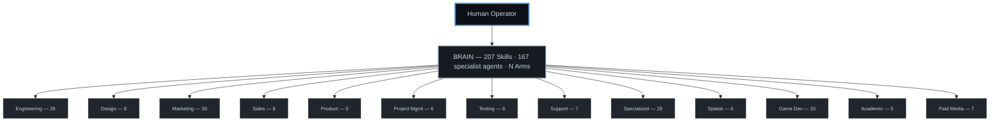

<p align="center">
  
</p>

> 🌍 This README is in English (the open-source lingua franca). Running an AI agent? Ask it to read this in your language — eating our own dog food. 🐙

# Octorato

> *an Octorato (n.) — an organic, file-native AI agent: one brain, many sealed arms. The same wall that seals a client is the wall that bills them.*
>
> <sub>the Octopus Brain Framework</sub>

> **Octorato is an open-source AI agent operating system: one file-native "brain" — <!--canon:skills.count-->200+<!--/canon--> skills and <!--canon:agents.count-->160+<!--/canon--> specialist agents in plain markdown under git — that one operator runs across many isolated client "arms."**

[](LICENSE)
[](https://github.com/CarlosCaPe/octorato/stargazers)
[](https://github.com/CarlosCaPe/octorato/issues)
[](https://github.com/CarlosCaPe/octorato/issues?q=is%3Aissue+is%3Aopen+label%3A%22good+first+issue%22)
[](CHANGELOG.md)

📄 **White paper:** [Octorato — An Organic, File-Native Model of Artificial Agency](WHITEPAPER.md) · 🌐 [Live: dataqbs.com/octorato](https://www.dataqbs.com/octorato) · 📣 [Launch article](https://www.linkedin.com/pulse/introducing-octorato-open-source-finops-brain-ai-agents-dataqbs-trbjc) · 🛠️ [Built with Octorato](SHOWCASE.md) · 📘 [dataqbs on Facebook](https://www.facebook.com/dataQBS/)

> 🧑‍💻 **New here? [Start Here → contributing guide](https://github.com/CarlosCaPe/octorato/issues/34).** Grab a [good first issue](https://github.com/CarlosCaPe/octorato/issues?q=is%3Aissue+is%3Aopen+label%3A%22good+first+issue%22), see where we're headed in the [ROADMAP](ROADMAP.md), or shape the architecture in the [RFCs](https://github.com/CarlosCaPe/octorato/discussions). Newcomers welcome — we credit every contributor. 🐙

<!-- TODO(demo): add a terminal demo here — asciinema cast or GIF of "natural language → shipped product". Tracked as a maintainer follow-up. -->

> **An Octorato is an organic, file-native AI agent OS — and because its arms are sealed cells, it has built-in FinOps.**
> The brain consultants and small agencies need to bill clients fairly — and land on the right side of the
> [Gartner prediction that 40% of agentic AI projects will be canceled by 2027](https://www.gartner.com/en/newsroom/press-releases/2025-06-25-gartner-predicts-over-40-percent-of-agentic-ai-projects-will-be-canceled-by-end-of-2027)
> over unmanaged cost.
>
> *Honest scope: per-client cost is an **estimate** from local session logs at list price, attributed by repo path (a small unattributed remainder is expected). The budget halt is real code — `budget-check.py` exits 2 and a `PreToolUse` hook refuses the tool — but it arms itself only once you configure `budgets.yaml`. The mechanism is real; the precision is opt-in, and we say which is which.*

> *"One brain. Sealed arms. One ledger per client — because the arm IS the ledger."*

---

## 🚀 Built with Octorato — live, in production

Octorato isn't a demo — it ships real software. A few of the products this brain built and maintains (full list in the **[showcase](SHOWCASE.md)**):

| Product | Live |
|---|---|
| Trilingual Astro/Cloudflare site + RAG chatbot | **[dataqbs.com](https://dataqbs.com)** |
| Multi-Reach — compose once, publish across 6 social channels | **[/multi-reach](https://dataqbs.com/multi-reach)** |
| White-label real-estate catalog w/ daily FB auto-publish | **[/realestate](https://dataqbs.com/realestate)** |
| Open Garage — commission-free marketplace, direct WhatsApp | **[/open-garage](https://dataqbs.com/open-garage)** |
| AI persona bot — answers *as the operator* (RAG + dynamic PDF) | **[/carloscarrillo](https://dataqbs.com/carloscarrillo)** |
| Daily AI-news blog + curated news surface | **[/blog](https://dataqbs.com/blog)** · **[/news](https://www.dataqbs.com/news)** |

→ **Want to build things like these?** [Start Here](https://github.com/CarlosCaPe/octorato/issues/34) — newcomers welcome, every contributor credited. 🐙

---

## Table of Contents

- [🚀 Built with Octorato — live](#-built-with-octorato--live-in-production)

- [Why now: the token economy is here](#why-now-the-token-economy-is-here)
- [What makes Octorato different](#what-makes-octorato-different)
- [What it is](#what-it-is)
- [FinOps roadmap](#finops-roadmap)
- [Daily Self-Growth](#daily-self-growth)
- [Why an Octopus?](#why-an-octopus)
- [Migrating from dotclaude (May 2026)](#migrating-from-dotclaude-may-2026)
- [Quick Start](#quick-start)
- [Architecture — CLASS / OBJECT / ARM](#architecture--class--object--arm)
- [The 4D Paradigm — The Nervous System](#the-4d-paradigm--the-nervous-system)
- [4D+S — Spec-Driven Development Integration](#4ds--spec-driven-development-integration)
- [The Corporation](#the-corporation)
- [The Connectome — Neural Architecture](#the-connectome--neural-architecture)
- [Client Arms — Total Isolation](#client-arms--total-isolation)
- [Org Chart — 13 Divisions, 167 Agents](#org-chart--13-divisions-167-agents)
- [Synapses — The Skill Layer](#synapses--the-skill-layer)
- [Memory — Hippocampus and the Working Set](#memory--hippocampus-and-the-working-set)
- [Reflexes — The Spinal Cord Layer](#reflexes--the-spinal-cord-layer)
- [Observability — The Sensory Cortex](#observability--the-sensory-cortex)
- [Enforcement Scripts](#enforcement-scripts)
- [MCP Servers — The Action Space](#mcp-servers--the-action-space)
- [Multi-Tool Support](#multi-tool-support)
- [Multi-Machine Sync — The Glial Layer](#multi-machine-sync--the-glial-layer)
- [Repository Structure](#repository-structure)
- [10x Roadmap](#10x-roadmap)
- [Contributing](#contributing)
- [License](#license)

---

## Why now: the token economy is here

The AI industry is splitting into **three billing primitives** —
tokens ([Anthropic](https://www.anthropic.com/pricing), [OpenAI](https://openai.com/api/pricing/)),
steps ([AWS Bedrock AgentCore](https://aws.amazon.com/bedrock/agentcore/pricing/)),
and outcomes ([Salesforce Agentforce, ~$2/conversation](https://www.salesforce.com/agentforce/pricing/)).
Anthropic [announced a June 2026 enterprise pricing shift](https://www.implicator.ai/anthropic-shifts-enterprise-billing-to-per-token-pricing-the-flat-fee-era-is-over/)
moving Claude / Claude Code / Cowork to per-token pass-through.
[a16z's State of AI](https://a16z.com/state-of-ai/) reports OpenRouter crossed **>100T tokens/year** in 2025
with agentic workloads burning 5–30× more tokens than chatbots.
[BCG estimates a $200B agentic TAM](https://www.bcg.com/publications/2025/rethinking-b2b-software-pricing-in-the-era-of-ai)
in tech services and recommends outcome-based pricing for B2B SaaS.
The [FinOps Foundation's 2026 State of FinOps](https://www.finops.org/wg/finops-for-ai-overview/) lists AI FinOps as the **#1 mandate**.

Enterprises need governance. Solo consultants and small agencies need it
*more* — they're invoiceable for the burn, not absorbing it on a runway.

**Octorato is the open-source FinOps brain for that segment.** Larger teams use the same primitives at higher cardinality.

---

## What makes Octorato different

| Layer | Crowded by | Octorato's wedge |
|---|---|---|
| Agent frameworks | LangGraph, CrewAI, AutoGen, LlamaIndex | We don't compete here — Octorato is an OS, not a framework. Bring your own. |
| Agent observability | LangSmith, Langfuse, Arize, Datadog LLM Obs | Complementary. Octorato emits OpenInference-style spans; sits *above* your observability stack as the governance layer. |
| **FinOps for AI Agents** | greenfield (Vantage, Amnic, Finout fighting for category, no Gartner MQ yet) | **The only one of these that ships per-client isolation + cost ledger + budget halt as open-source files** — because the arm is both the security cell and the billing line item. We don't claim to lead a quadrant; we occupy an intersection no one else does. |
| Compute sandboxes | e2b.dev | Complementary (arms can run in e2b sandboxes). |
| **Operator brains / `~/.claude` distributions** | ECC (`affaan-m/ECC`), dotclaude variants, claude-flow, wshobson/agents collections | Most are *one bag of skills*. Octorato is an **OS with multi-tenant isolation**: per-client arms, per-client cost ledger, per-client budget caps. We learn from peer brains daily (`repo-watch` skill) without absorbing their multi-tenancy gap. |

**Three things competing observability tools don't have:**

1. **Per-arm cost attribution** — every trace event tags the client (`arm`), and `skill-cost-profiler.py` produces a billable cost rollup per project, per month, per skill, with USD applied via the shared `_pricing.py` table. Privately. On your filesystem. No SaaS dependency.
2. **Sealed multi-tenancy** — clients live in sealed repos (software-level isolation — no shared state, no cross-arm reads). The brain sees their cost data read-only; the arms never see each other. Datadog can't enforce this; LangSmith Cloud isn't designed for it.
3. **Budget caps that actually halt agents** — `budget-check.py` reads `budgets.yaml`, computes month-to-date spend per arm, and exits with code 2 when the cap is burned through. A `PreToolUse` hook wires that into `Agent` / subagent / browser tools so the operator can't accidentally torch a client's budget. CFO buy signal, not telemetry buy signal.

FinOps is the wedge. The architecture under it is biology — because the same problem the operator faces (*one consciousness, many client workspaces, no cross-contamination*) is the problem an octopus solves with eight semi-autonomous arms. The cost ledger and the neural map share the same substrate: per-arm isolation.

---

## What it is

An open-source AI agent operating system where a single human operator directs a shared brain of specialist AI agents — across clients, projects, and machines — without ever mixing their data or their bills.

With nothing but natural language, you can direct a team of AI specialists to build and ship software, and bill the client honestly when it ships.

**Live framework**: 207 skills, 167 agent personas across 13 divisions, enforcement scripts, multi-machine sync, a neural connectome that learns over time, and a FinOps pipeline that tags every trace event with the client who incurred it — with per-arm USD rollup and a `PreToolUse` budget halt **shipped, opt-in** (configure `budgets.yaml` to arm caps; run the `anthropic-enterprise-analytics` pull to reconcile estimate against billed cost). See [roadmap below](#finops-roadmap).

**Shipped with it**: live products built and maintained agent-first on this brain — see [Built with Octorato](SHOWCASE.md).

```
https://github.com/CarlosCaPe/octorato
```

> **Octorato** = *octopus* + *tesseract* — eight-armed brain in a 4D activation space (Agent × Skill × Arm × 4D-phase).

---

## FinOps roadmap

- [x] Trace capture per skill / agent / phase (`scripts/trace-hook.py` + 8 hook points)
- [x] Daily brain digest with cost section (`scripts/brain-digest.py` via cron)
- [x] Skill-level cost profiler 30-day window (`scripts/skill-cost-profiler.py`)
- [x] SLO + watchdog infrastructure (`success_rate` SLI)
- [x] Per-event `arm` tagging (`trace-hook.py` reads cwd → client id)
- [x] **Per-arm cost rollup + USD conversion** (`scripts/_pricing.py` + `skill-cost-profiler.py` aggregates by arm, digest renders the table)
- [x] **Cost-spike watchdog** (`watchdog.py` z-score over tokens/day per skill·arm against 30d baseline; floor at 100k tokens to avoid noise)
- [x] **Budget caps + PreToolUse hard-stop hook** (`scripts/budget-check.py` reads `budgets.yaml`, exit 2 = halt; see [`finops-budget-policy`](skills/finops-budget-policy/SKILL.md))
- [x] **Anthropic Enterprise Analytics API ingest** (`scripts/anthropic-analytics-pull.py` reconciles estimated vs billed; see [`anthropic-enterprise-analytics`](skills/anthropic-enterprise-analytics/SKILL.md))
- [x] **Claude Cowork integration shape** — quarantined pseudo-arm `cowork-shared`, never mounts a client arm directory ([design](docs/specs-archive/2026-05-20-claude-cowork-plugin/feature.md)). Enforcement hook deferred until Anthropic publishes the Cowork session-event API surface; Cowork billed cost is already captured today via the Admin Analytics ingest.

See the [biology section](#why-an-octopus) below for *why* the architecture takes this shape.

---

## Daily Self-Growth

The brain grows itself. Every day a scheduled loop scans GitHub Trending, Hacker News, and Product Hunt for new tools, runs each candidate through a deterministic brain-fit classifier plus an LLM quality gate, and **auto-promotes** the survivors that clear the bar into real skills — then publishes what it learned.

- **Discover** → [`github-trending-curation`](skills/github-trending-curation/SKILL.md) pulls multi-source trending, dedupes against the existing connectome (TF-IDF cosine), and tags each candidate with an integration *action*: `ADD` / `MERGE-WITH` / `REPLACE` / `EXTEND` / `SKIP`. The point is **harmonization, not accretion** — the brain is a connected graph, not a pile of skills.
- **Watch peers** → [`repo-watch`](skills/repo-watch/SKILL.md) is the *targeted* sibling of trending: a curated 7-repo daily monitor (competitors, peer brains, upstream Claude Code projects) that classifies each day's diff as HIGH / LOW / EMPTY / BASELINE signal and drops a **file-based trigger** into `knowledge/repo-watch/triggers/` for [`repo-deep-learn`](skills/repo-deep-learn/SKILL.md) to pick up out-of-band. Detection state ≠ action state — the cron stays fast and the analysis stays deliberate.
- **Decide** → an LLM QA gate drops low-value noise; only net-new `ADD` candidates auto-apply (structural `MERGE`/`REPLACE`/`EXTEND` are left for human review).
- **Grow & publish** → survivors become `skills/<name>/SKILL.md`, a changelog article on the public `/news` feed (crediting the source repo — *it's a community to grow with*), and a social post. Every day's decisions — added, deferred, and **ignored-with-reason** — are appended to a single audit ledger (`knowledge/github-trending/HISTORY.md`) so the operator can scroll the whole history and challenge any call.

No daily human validation required: the AI tooling landscape moves faster than any one person can review, so the operator audits the ledger on their own cadence instead of gatekeeping every item.

---

## Why an Octopus?

This isn't a metaphor we forced onto the software. The software emerged from studying how *Octopus vulgaris* actually works — and discovering that its neural architecture solves the exact problem we face with AI agents.

### The Biology

An octopus has approximately **500 million neurons**. For context, a dog has roughly 530 million in its cerebral cortex alone (and about 2 billion total in its brain). But here's what makes the octopus extraordinary: **two-thirds of its neurons live in the arms, not the central brain.**

Each arm can:
- **Taste and smell** independently (each sucker has chemotactile receptors — van Giesen, Kilian, Allard & Bellono, *Cell* 2020 — work performed in *Octopus bimaculoides*)
- **Execute local reflexes and stereotyped reaching motions** without consulting the brain (Sumbre et al., *Science* 2001 — note: isolated arms perform programmed motor patterns, not contextual decision-making)
- **Coordinate** with the central brain for complex tasks
- **Operate with high autonomy** from other arms (peripheral nerve cords provide some inter-arm communication, but each arm has its own local control)

Beyond the arms, the octopus has:
- **Chromatophores** — tens of thousands of individually innervated color cells that allow real-time pattern changes in under a second
- **A vertical lobe** — the primary learning center, where ~25 million amacrine cells converge onto ~65,000 efferent neurons (a biological dimensionality reduction system)
- **Autotomy** — the ability to voluntarily detach an arm under threat and fully regenerate it
- **Extensive mRNA recoding** — A-to-I RNA editing that modifies over 13,000 protein-coding sites, reshaping neural protein function in response to environmental conditions

The central brain sets high-level intent. The arms execute with local intelligence. Information flows **up** (arm discoveries reach the brain) and **down** (brain strategies reach the arms). In biology, some peripheral inter-arm communication exists — but in our software, we enforce **total sideways isolation** as a deliberate design choice for client data security.

The full biology-to-software mapping table (with ML-accuracy notes on each analogy) lives in [wiki Architecture §9](https://github.com/CarlosCaPe/octorato/wiki/Architecture#the-software-mapping).

### The 8 and the Tesseract

Two symbols sit behind the name. Both are mathematical.

**The 8 → ∞.** An octopus has eight arms. Rotate the 8 ninety degrees and it becomes ∞ — the lemniscate. Octorato is built for an *unbounded* number of sealed arms because the brain distributes only generic knowledge downward and arms never see each other. Multi-tenancy without ceiling. The 8 is symbolic; the ∞ is the engineering claim.

**The Tesseract → 4D.** The 4D Paradigm — Describe → Delegate → Diligent → Disclose — is named *4D* on purpose. A tesseract is the 4-dimensional analog of a cube. The four phases are not sequential steps but **dimensions**, active simultaneously in every action. Working inside the brain is working in 4-space, and from there shaping outcomes in 3-space: the codebase, the deliverable, the invoice. The 4D is not a workflow checklist; it is the control plane.

And the 4D doesn't run once — it runs in a **WHILE**. Each response ends with a one-line *Provenance* footer (Basis · Engine · Touched · Verified): the brain sensing its own action — proprioception. Reading it is the loop condition (anything open? did what I *touched* match what I *meant*?) and the trigger of the next beat. A human can't be in ten places at once; Octorato is the vehicle that lets one operator inhabit that dimension — many sealed arms acting in parallel under one brain. The tesseract you can't perceive, Octorato lets you live in.

The metaphor and the engineering are the same thing. Full reference: [`skills/octorato-symbolism/SKILL.md`](skills/octorato-symbolism/SKILL.md).

---

## Migrating from dotclaude (May 2026)

The repo was renamed from `dotclaude` → `octorato`. If your laptop's `~/.claude/` still has `origin` pointing to the deleted `dotclaude` repo, **one of these options will fix it**:

**Option A — automatic (run once per laptop):**
```bash
bash ~/.claude/scripts/migrate-octorato.sh
```

**Option B — manual one-liner:**
```bash
git -C ~/.claude remote set-url origin https://github.com/CarlosCaPe/octorato.git
```

After either, `ai-pull` / `ai-push` work normally. The Windows `ai-pull.ps1` / `ai-push.ps1` scripts self-heal on next run — no manual step needed there once they're updated.

---

## Quick Start

```bash
# 1. Clone the brain
git clone https://github.com/CarlosCaPe/octorato.git ~/.claude

# 2. Create your private company brain
cp -r ~/.claude/templates/company/ ~/.claude/company/
mv ~/.claude/company/COMPANY.md.template ~/.claude/company/COMPANY.md
nano ~/.claude/company/COMPANY.md

# 3. Create your first arm (client project)
mkdir -p ~/projects/my-client/.claude
cp ~/.claude/templates/arm/CLAUDE.md.template ~/projects/my-client/.claude/CLAUDE.md

# 4. Sync across machines
ai-pull    # on every workstation
```

See `templates/` for annotated setup guides with `{{PLACEHOLDERS}}`.

### Branching & contribution model

The brain uses **staged promotion**. All pull requests — contributors, day-to-day work, and bot-authored skills — target **`test`**, the integration branch where ideas are iterated and reviewed. **`master`** is the curated, public canonical and is **promotion-only**: it advances solely through a weekly, operator-reviewed `test → master` promotion (the `/promote-test` ritual).

```
PRs ─▶ test ──weekly /promote-test (reviewed)──▶ master (protected, public canonical)
```

Fork → branch off `test` → PR against `test`. Full guide: [CONTRIBUTING.md](CONTRIBUTING.md). *(The daily dataqbs.com content feed is the exception — it ships to its own repo's `master` daily; staging is for the brain.)*

---

## Architecture — CLASS / OBJECT / ARM

The framework uses an object-oriented inheritance model: **BRAIN = CLASS** (this public repo, the DNA) → **COMPANY BRAIN = OBJECT** (your private `~/.claude/company/`, gitignored) → **ARMS = PROPERTIES** (isolated per-client repos that never see each other).

The brain ships the engine — 4D Paradigm, connectome, agents, skills, enforcement scripts, templates. The company brain holds your identity and arm definitions. Each arm holds one client's context, sealed.

The reactive control architecture (ECA atoms · Behavior-Tree priority · Statechart 4D · Bandit routing) that governs hook composition is in [`docs/architecture/hook-orchestration.md`](docs/architecture/hook-orchestration.md). Full CLASS/OBJECT/ARM anatomy, biology mapping, and information-flow rules: [wiki Architecture](https://github.com/CarlosCaPe/octorato/wiki/Architecture).

---

## The 4D Paradigm — The Nervous System

The 4D is not a checklist. It is the **nervous system protocol** — every signal in the octopus follows four phases. No exceptions.

**1D Describe** → state what and why before acting. **2D Delegate** → search the connectome (Q1: who knows?), check for an API (Q2: MCP first), run delegate-check (Q3: who does it?). **Change Gate** → present a full manifest of every file to create/modify/delete, wait for explicit confirmation. **3D Diligent** → validate with evidence (build/lint/test); FAIL means fix, not ship. **4D Disclose** → scan the Impact Radius; every change radiates.

Think of it like `terraform plan` before `terraform apply`. The agent presents a **Change Manifest** and stops and waits. No fire-and-forget. This is a gate, not a suggestion.

The 4D runs in a **WHILE** — `while (open work / Touched ≠ intent): 4D()`. Each response ends with a *Provenance* footer (Basis · Engine · Touched · Verified): the brain's proprioception, and the loop condition for the next beat.

Full protocol, gate formats, validation matrix, enforcement scripts, and the WHILE loop: [wiki The-4D-Paradigm](https://github.com/CarlosCaPe/octorato/wiki/The-4D-Paradigm) · [`skills/4d-paradigm-protocol/SKILL.md`](skills/4d-paradigm-protocol/SKILL.md).

---

## 4D+S — Spec-Driven Development Integration

For tasks above trivial complexity, the 4D integrates with a spec-driven workflow:

| Score | Level | What Activates |
|-------|-------|---------------|
| 0-2 | **TRIVIAL** | 4D only (no spec artifacts) |
| 3-5 | **MEDIUM** | 4D + `plan.md` (task checklist feeds the Gate) |
| 6+ | **LARGE** | 4D + full SDD: `feature.md` → `plan.md` → implement → `review.md` → archive |

**Complexity signals:** +2 touches 4-10 files, +4 touches 10+, +2 new feature, +3 architecture decision, +5 user requests spec, +1 schema change, +1 new API.

The archived specs become institutional memory — future tasks reference past decisions.

---

## The Corporation

```
                        ┌─────────────────┐
                        │   HUMAN         │
                        │   (Operator)    │
                        │   Human Gateway │
                        └────────┬────────┘
                                 │
                        ┌────────▼────────┐
                        │   BRAIN         │
                        │  ~/.claude/     │
                        │  207 Skills      │
                        │  167 Agents      │
                        │  N Client Arms  │
                        │  HOOKS — enforcement reflexes           │
                        │  (delegate · qa-merge · dimension-awareness) │
                        └────────┬────────┘
                                 │
            ┌──────┬──────┬──────┼──────┬──────┬──────┐
            ▼      ▼      ▼      ▼      ▼      ▼      ▼
         ARM 1  ARM 2  ARM 3  ARM 4  ARM 5  ARM 6  ARM N
```

### The 3-Layer Activation Stack

Every task activates three layers simultaneously:

```
1. AGENT  = WHO       (persona, expertise, voice)
2. SKILL  = HOW       (technique, workflow, best practices)
3. ARM    = FOR WHOM  (client context, data, config)
```

**Example**: A client needs a database audit:
- Brain activates **Database Optimizer** agent (WHO)
- Loads `explain-analyze-validation` + `index-creation-concurrently` skills (HOW)
- Operates within the client's arm context (FOR WHOM)
- Result: specialist persona crafting idempotent DDL, scoped to this client only

### Activation Modes

| Mode | Trigger | Example |
|------|---------|---------|
| **Auto** | Brain detects task matches agent domain | Database query activates Database Optimizer |
| **Manual** | User says "activate [Agent Name]" | "Use Proposal Strategist for this RFP" |
| **Combined** | Agent + skills + arm context | Security Engineer + threat-model skill + client arm |

---

## The Connectome — Neural Architecture

The brain maintains a **deep connectome** — a real weighted graph auto-generated by reading the FULL content of every agent and skill file, vectorizing with TF-IDF, and computing cosine similarity across all pairs.

Inspired by octopus neurobiology: 500M neurons, 2/3 distributed in arms, extensive mRNA recoding that reshapes neural protein function.

```
  D1 (WHO)     D2 (HOW)     D3 (WHERE)           D4 (WHEN)
  ────────     ────────     ─────────             ─────────
  160+         200+         N                     4
  Neurons      Synapses     Regions               Phases
  (Agents)     (Skills)     (Arms + parallel      (4D Paradigm)
                             git-worktree
                             session dims
                             v3.1.0)
```

| Architecture | Neuroscience | Function |
|---|---|---|
| **Agents** | **Neurons** | Processing units — WHO does the work |
| **Skills** | **Synapses** | Functional connections — HOW work gets done |
| **Agent↔Agent** | **Neural Pathways** | Collaboration channels — WHO works with WHO |
| **Skill↔Skill** | **Skill Clusters** | Capability families — related skills group |
| **Arms** | **Brain Regions** | Specialized areas — WHERE work happens |
| **4D Phases** | **Action Potentials** | Temporal signals — WHEN signals fire |

### Querying and generating

```bash
python3 ~/.claude/scripts/query_connectome.py query "deploy Svelte app to Cloudflare Workers"
python3 ~/.claude/scripts/generate_neural_map.py   # auto-runs on every ai-push
```

`query_connectome.py` builds a TF-IDF vector from the task, ranks every agent and skill by cosine similarity, and returns the best matches with scores — not just name/trigger matching, but full-content semantic similarity. `generate_neural_map.py` produces Agent↔Skill, Agent↔Agent, and Skill↔Skill weighted connections with Hebbian learning, hub detection, and gap detection. Rebuilds from scratch on every `ai-push`.

---

## Client Arms — Total Isolation

Each arm is an isolated client project. Arms never see each other's data. Only the human operator can explicitly bridge knowledge between arms.

Information flows strictly one-way: generic lessons rise from arm to brain (anonymized), brain rules and skills descend to all arms, and arms never communicate sideways — only the human operator bridges knowledge between them. Full flow rules: [wiki Architecture §5](https://github.com/CarlosCaPe/octorato/wiki/Architecture#information-flow-rules).

### The Learning Cycle

```
1. ARM discovers pattern      → "This query fix reduced seq scans 10x"
2. HUMAN approves capture     → "Yes, make it a skill"
3. BRAIN stores as skill      → ~/.claude/skills/explain-analyze-validation/SKILL.md
                                 (anonymized: no client name, no table names, no data)
4. BRAIN distributes to ALL   → ai-push / sync-ai-docs
5. OTHER ARMS benefit         → Next project loads the skill automatically
```

---

## Org Chart — 13 Divisions, 167 Agents



Full roster with per-agent triggers and specialties: [GitHub wiki — Agents](https://github.com/CarlosCaPe/octorato/wiki/Agents) · [`agents/REGISTRY.md`](agents/REGISTRY.md).

---

## Synapses — The Skill Layer

If agents are neurons, **skills are synapses**: the connection that makes a neuron useful for a specific task. A neuron in isolation does nothing. A neuron whose synapses know `index-creation-concurrently` and `query_connectome.py` becomes a database optimization specialist.

Skills are loaded on demand via Q1 (TF-IDF cosine similarity) or Q3 (keyword trigger match), injected into the agent's context for the duration of the task, and then either reinforce or decay the agent↔skill edge in the connectome based on 3D Diligent outcome. Lifecycle: **ADD** (pattern appears 3+ times) → **MERGE** (two skills converge) → **REPLACE** (better technique found) → **EXTEND** (new engine/variant). The full cycle — birth, Hebbian reinforcement, decay (~69-day half-life), failure penalty, pruning, rebirth — is in [wiki Skills-System](https://github.com/CarlosCaPe/octorato/wiki/Skills-System). The full catalog: [wiki Skills](https://github.com/CarlosCaPe/octorato/wiki/Skills).

```bash
python3 ~/.claude/scripts/query_connectome.py query "<task>"   # which skills fire
python3 ~/.claude/scripts/query_connectome.py gods 15          # hub skills
python3 ~/.claude/scripts/query_connectome.py communities      # skill clusters
```

---

## Memory — Hippocampus and the Working Set

Three layers: **Constitutional** (`CLAUDE.md` — always loaded, 4D rules + reflexes) · **Episodic** (`~/.claude/projects/<cwd>/memory/` — persists across sessions, gitignored, per-machine) · **Working** (the current context window, cleared on `/clear`).

Memory is two-tier by scope: generic cross-arm lessons and operator preferences go into a private standalone brain-memory repo (`1 + N` octopus brains — one central + one per arm). Arm memory is sealed in that arm's own repo. The public framework ships the engine (`scripts/memory_sync.py`, `templates/memory/`), never anyone's actual data. Full model: [`docs/architecture/memory-model.md`](docs/architecture/memory-model.md).

---

## Reflexes — The Spinal Cord Layer

> **v3.1.0 "Reflexes"** — the brain moved from _sensing_ itself (3.0 Proprioception) to _enforcing_ itself. Principles that were advisory prose became involuntary hooks wired at the harness level: they fire whether the model chooses to or not.

Not every behavior needs to go through the cortex. Some are too universal, too fast, too necessary to delegate. The spinal cord handles them: hand pulled from a hot surface, knee jerk, breathing rhythm. No conscious decision, no committee.

The framework has two reflex sub-layers: **Tier A cognitive reflexes** (constitutional, loaded at session start) and **enforcement hooks** (harness-level, fire on specific tool events regardless of the model's intent).

### Tier A — Cognitive reflexes (6, constitutional)

These fire automatically on every non-trivial task without the agent having to decide:

| Reflex | Stimulus | Response |
|--------|----------|----------|
| `workspace-skill-discovery` | Session starts in an arm | Load arm-local `.claude/skills/` alongside global skills |
| `session-memory-search` | About to re-solve a problem | Check git log + grep + Lessons Learned — did we do this before? |
| `progressive-code-exploration` | About to read a file >100 lines | Default to index-first, fetch-on-demand — 4–8x token savings |
| `token-efficient-prompting` | Drafting any response | Compact tables, no preamble, no filler |
| `post-check-verification` | About to declare "done" | Never on a write — always on a verify (build/lint/test/grep) |
| `dry-run-gate-pattern` | About to do something destructive | Preview/dry-run first; live execution requires explicit opt-in |

### Enforcement hooks — v3.1.0 additions (3, harness-wired)

These are `hooks.json` entries that the harness evaluates on every matching tool event. The model cannot skip them.

| Hook | Event | Coupling | What it enforces |
|------|-------|----------|-----------------|
| `delegate-gate` (`scripts/delegate-gate.py`) | PreToolUse | **Fail-open** | Nudges substantive/batchable work toward the cheapest sufficient model tier (Haiku/Sonnet/Opus); never blocks a turn on failure |
| `qa-merge-gate` (`scripts/qa-merge-gate.py`) | PreToolUse | **Fail-closed** | Blocks publish-to-main unless an operator approval the agent provably cannot self-grant is present (`OCTO_MERGE_APPROVE=<pr>` env or `octo-dim approve-merge <pr>`); detection is command-boundary-anchored so it gates real invocations, not quoted mentions |
| `dimension-awareness-hook` (`scripts/dimension-awareness-hook.py`) | PreToolUse | **Fail-open** | Warns when other live sessions share the working tree; surfaces the collision risk before a write, never after |

**Connector verdict enforcement.** The 2D Delegate verdict is now inverted by default: **SELF is the rare exception, CONNECT is the default**. The delegate-gate hook reinforces this at the harness level — answering "from my own knowledge" on a task that has a skill or agent match is caught before the tool fires.

### 4D Session dimensions — v3.1.0

The brain can run as **one session-id across N parallel isolated git worktrees**, each reconciled into one `.git`. This is the octopus superpower applied to time: many arms acting in parallel under one brain, without collision.

`scripts/octo-dim.py` manages the blackboard registry (`connectome/sessions.json`, gitignored):

```bash
octo-dim worktree-init          # fork a new isolated dimension (new worktree + session id)
octo-dim list                   # show all live dimensions on this machine
octo-dim heartbeat              # signal this dimension is still alive
octo-dim approve-merge <pr>     # grant the qa-merge-gate approval (operator-only)
octo-dim prune                  # remove stale dimension entries
```

The architecture spec for all three enforcement hooks, the ECA atom formalism, Behavior Tree priority, and the Statechart 4D phase machine lives in [`docs/architecture/hook-orchestration.md`](docs/architecture/hook-orchestration.md).

Reflexes live in `CLAUDE.md` (constitutional, loaded before any task), not in `skills/` (opt-in). Six constitutional rules + three harness hooks govern thousands of decisions downstream.

---

## Observability — The Sensory Cortex

The brain observes itself acting. Every skill activation, subagent spawn, and 4D phase boundary is captured as a structured JSONL event (`schemas/trace-event.schema.json`) in `~/.claude/traces/YYYY-MM-DD.jsonl` (gitignored, 30-day retention). The trace feeds back into the Hebbian connectome via `update_neural_activity.py`.

Eight shipped surfaces:

| # | Surface | Script |
|---|---------|--------|
| 1 | Agent Trace (APM-style) | `trace-hook.py` · `brain-trace.py` · `update_neural_activity.py` |
| 2 | Skill Cost Profiler | `skill-cost-profiler.py` |
| 3 | Brain SLOs + Error Budget | `slos.py` |
| 4 | Watchdog (cliff + quality-drop) | `watchdog.py` |
| 5 | Brain Digest (daily dashboard) | `brain-digest.py` |
| 6 | Incident Capture (post-mortems) | `incident-capture.py` |
| 7 | Brain Synthetics (per-arm health) | `arm-synthetics-runner.py` |
| 8 | Brain Charts on Demand | `brain-chart.py` |

```bash
brain-trace.py grep --event phase_boundary --since 1h   # filter traces
brain-trace.py top  --by name --window 7d               # top skills/agents
brain-trace.py tail -n 20 -f                            # live tail
```

Full schema, storage layout, and cron setup: [`docs/architecture/trace-storage.md`](docs/architecture/trace-storage.md).

---

## Enforcement Scripts

These are not optional helpers. They are the nervous system's enforcement layer — scripts that the agent runs at specific gates to ensure the 4D protocol is followed.

| Script | When It Runs | What It Does |
|--------|-------------|-------------|
| `delegate-check` | Start of every task | Parses REGISTRY.md + skills, finds matching agents and skills, outputs ACTIVATE/LOAD/SELF |
| `query_connectome.py` | Start of every task | TF-IDF cosine similarity against stored document vectors, ranks by semantic match |
| `gate-check` | Before any file write | Validates that Describe + Delegate phases completed before allowing writes |
| `generate_neural_map.py` | On every `ai-push` | Rebuilds the full connectome from all agent/skill content |
| `merge-hooks.py` | On every `ai-pull` | Syncs shared hooks into local settings, validates script targets exist |
| `eye-check.py` | On every user prompt | Detects web-related tasks, injects browser automation context |
| `check-generic.py` | Every git commit (pre-commit + commit-msg hooks) | Scans staged files + commit message against `company/brain-blocklist.txt`; hard-blocks commits that leak arm codes, client names, or internal tokens |
| `check-readme-sync.sh` | Every git commit (pre-commit hook) | Soft-blocks (prompts y/N) when `skills/`, `agents/`, or `scripts/` change but `README.md` is not also staged. Won't break automation (passes through when no TTY) |

---

## MCP Servers — The Action Space

The brain talks to the outside world through **Model Context Protocol** servers. MCP is not a fallback when there's no API — it *is* the action space of the agent. Agents are the policies that decide what to do; skills are the manuals that teach how; **MCP servers are the typed, schema-validated tools the agent actually calls**.

```
Query → Connectome (routing) → Agent persona → Skill (manual) → MCP tool call → Tool response
                                                                                       │
                                       ┌──────────────── Reflection ←──────────────────┘
                                       ▼
                              Reward (3D Diligent PASS/FAIL) → Hebbian log → next routing
```

### Where MCP fits in the 4D paradigm

| 4D phase | MCP role |
|---|---|
| **1D Describe** | If the task names a system (Gmail, Linear, Cloudflare), declare which MCP servers will be used. |
| **2D Delegate — Q2** | "¿Tiene API?" is **MCP-first**: prefer an MCP tool over scraping. MCP > REST > SDK > scrape (in capability terms; tokens-wise REST is cheaper, so the agent chooses based on whether typed schema/auth/persistence matter for this call). |
| **3D Diligent** | Validate via the same MCP server: the response shape *is* the test. |
| **4D Disclose** | Impact Radius includes external state — what got written to Linear / sent through Gmail / deployed to Cloudflare. |

### Server registry & secret management

| Layer | File | Synced? | Contains |
|---|---|---|---|
| Global config | `~/.claude/mcp/servers.json` **(P2 roadmap — not yet in repo)** | Planned | Server `{id, transport, command|url, env_refs[], capabilities, scope}` — references, never values |
| Per-arm override | `<arm>/.claude/mcp/servers.local.json` | No (arm-local) | Client-specific MCP endpoints that must not leak across arms |
| Secrets | `~/.config/octorato/secrets.env` (chmod 600) or system keychain | **No — never synced** | Tokens, API keys, OAuth refresh — resolved at startup by `env_refs[]` |
| Capability cache | `~/.claude/mcp/capabilities/<server_id>.json` | Planned | Tool manifest fetched at connect time, dated |

**Secret resolution order:** env var → user keychain (`security`/`secret-tool`/`wincred`) → company vault → **fail closed** (never prompt mid-task).

**Per-arm isolation parity:** MCP follows the same arm-isolation rule as everything else. An arm's MCP config never leaks into the global registry. Arm-to-arm MCP sharing requires explicit human action — same as code-level arm isolation.

### Currently common MCP servers in this brain

| Server | Used for | Skill that loads it |
|---|---|---|
| **Cloudflare Developer Platform** | Workers, D1, R2, KV, Hyperdrive ops | `cloudflare-deploy` |
| **Gmail** | Drafts, threads, labels (operator's mailbox) | `notion-research-documentation` (when source is mail) |
| **Google Calendar** | Event read/write, scheduling | `notion-meeting-intelligence` |
| **Google Drive** | File search + content read | `notion-research-documentation` |
| **Microsoft Learn** | Official Azure/.NET docs lookup | `aspnet-core`, `winui-app` |
| **Notion** | Doc create/update, knowledge capture | `notion-knowledge-capture`, `notion-spec-to-implementation` |
| **Linear** | Issue read/update, project tracking | `linear` |
| **Sentry** | Production error inspection | `sentry` |
| **Figma** | Design context, node-to-code | `figma`, `figma-implement-design` |

### MCP as a routing signal (roadmap)

Today MCP servers are not first-class neurons in the connectome — Q2 is a mental check, not a graph query. The roadmap (P2) treats every MCP tool as a `mcp_tool` node alongside agents and skills:

- `query_connectome.py query "send slack message"` → returns `mcp_tool: slack-send (score 0.94)`
- Operator's *situated state* (active Linear issue, next Calendar event, recent Drive files) fuses with the query vector, so retrieval becomes context-aware without the operator typing the context

This is the path the framework is on — see "10x Roadmap" below.

### Adding a new MCP server

> `mcp/servers.json` is **P2 roadmap** — the `mcp/` directory does not yet exist in the repo. Today, MCP servers are configured directly in Claude Code's settings. Steps below describe the planned workflow once P2 lands.

1. Add the server to `~/.claude/mcp/servers.json` with `env_refs` pointing to your secret names (no values).
2. Put the actual secrets in `~/.config/octorato/secrets.env` (chmod 600, gitignored).
3. Run `ai-push` — the server config syncs; the secrets do not.
4. On other machines, `ai-pull` brings the config; add the matching secrets locally.

---

## Multi-Tool Support

The brain works simultaneously with three AI coding assistants:

| Tool | Config File | Synced By |
|------|------------|-----------|
| **Claude Code** | `.claude/CLAUDE.md` | Source of truth (edit here) |
| **GitHub Copilot** | `.github/copilot-instructions.md` | Auto-copied by `sync-ai-docs` |
| **Cursor** | `.cursorrules` | Auto-copied by `sync-ai-docs` |

One file to maintain. Three tools stay in sync.

```bash
sync-ai-docs          # Sync all arms
sync-ai-docs my-client  # Sync one arm
```

---

## Multi-Machine Sync — The Glial Layer

In real brains, glial cells outnumber neurons roughly 1:1 and do the unsexy work: shuttling nutrients, insulating axons, cleaning up waste, keeping the neurons alive. They don't fire signals themselves — they make signal-firing possible.

The framework's glial layer is the sync + hooks infrastructure: `ai-push`, `ai-pull`, `sync-ai-docs`, `install-git-hooks.sh`, `merge-hooks.py`, `check-generic.py`, `check-readme-sync.sh`. None of these are agents. None are skills. They don't show up in the connectome. But every agent and skill depends on them being alive: distributing the brain to all workstations, enforcing the generic-leak guard, keeping arm CLAUDE.mds in sync.

The brain is a git repo. The glia are what make it portable.

```bash
# Push brain changes (primary machine)
ai-push "added skill: playwright"

# Pull latest brain (any other machine)
ai-pull

# Check if updates available
ai-pull --status
```

---

## Repository Structure

```
~/.claude/
├── CLAUDE.md                ← Global rules (The Octopus Constitution)
├── README.md                ← You are here
├── LICENSE                  ← MIT
├── CONTRIBUTING.md          ← How to add agents, skills, contribute
├── HEBBIAN_LEARNING.md      ← How the connectome learns over time
├── hooks.json               ← Shared hooks (source of truth, synced to all machines)
├── neural_map.json          ← The Deep Connectome (auto-generated, never edit)
├── agents/                  ← 167 specialist agents
│   ├── REGISTRY.md          ← Auto-activation triggers & cross-references
│   ├── engineering/         ← 28 agents
│   ├── design/              ← 8 agents
│   ├── marketing/           ← 30 agents
│   ├── sales/               ← 8 agents
│   ├── product/             ← 5 agents
│   ├── project-management/  ← 6 agents
│   ├── testing/             ← 8 agents
│   ├── support/             ← 7 agents
│   ├── specialized/         ← 29 agents
│   ├── spatial-computing/   ← 6 agents
│   ├── game-development/    ← 20 agents
│   ├── academic/            ← 5 agents
│   ├── paid-media/          ← 7 agents
│   ├── strategy/            ← NEXUS orchestration playbooks and runbooks
│   └── examples/            ← Multi-agent workflow examples
├── skills/                  ← 207 reusable techniques
├── scripts/
│   ├── ai_sync.py                 ← Multi-machine sync engine (pull/push/sync/status verbs)
│   ├── generate_neural_map.py     ← Connectome generator (TF-IDF + cosine + Hebbian)
│   ├── query_connectome.py        ← Suction cups — graph search for agent/skill matching
│   ├── delegate-check             ← 2D pre-research gate
│   ├── gate-check                 ← 4D change gate enforcement
│   ├── merge-hooks.py             ← Hook sync with script-exists validation
│   ├── eye-check.py               ← Browser automation detector
│   ├── trace-hook.py              ← Observability capture hook (trace events)
│   ├── brain-trace.py             ← Observability query CLI (grep / top / tail)
│   ├── brain-chart.py             ← Observability charts on demand (ASCII / SVG)
│   ├── brain-digest.py            ← Daily aggregator report
│   ├── watchdog.py                ← Anomaly detector (cliff + quality drops)
│   ├── slos.py                    ← SLO evaluator + error-budget burn rate
│   ├── skill-cost-profiler.py     ← Per-skill token cost ranking
│   ├── incident-capture.py        ← Structured post-mortem writer
│   ├── arm-synthetics-runner.py   ← Per-arm health-check probe runner
│   ├── _brain_obs.py              ← Shared library for the 10 obs scripts (private)
│   ├── update_neural_activity.py  ← Hebbian update from trace co-activations
│   ├── scan-external-refs         ← Scan for external URL references
│   ├── delegate-gate.py           ← v3.1 hook: model-tier routing nudge (fail-open)
│   ├── qa-merge-gate.py           ← v3.1 hook: operator-approval gate for merges (fail-closed)
│   ├── dimension-awareness-hook.py← v3.1 hook: shared-worktree collision warning (fail-open)
│   ├── octo-dim.py                ← v3.1: session-dimension registry (worktree-init / list / approve-merge)
│   ├── ai-push.ps1                ← PowerShell variant for Windows
│   ├── ai-pull.ps1                ← PowerShell variant for Windows
│   └── sync-ai-docs.ps1           ← PowerShell variant for Windows
├── schemas/                  ← JSON schemas for structured artifacts
│   ├── trace-event.schema.json ← Trace event contract (v1.0, strict)
│   └── tests/trace-samples/    ← 4 validating sample records
├── docs/                     ← Architecture + design docs
│   ├── architecture/
│   │   └── hook-orchestration.md ← v3.1 Reactive Control Architecture spec (ECA · BT · Statechart · Bandit)
│   └── trace-storage.md        ← Trace storage layout + retention + backup
├── traces/                   ← (gitignored) Per-UTC-day JSONL trace files
├── commands/                ← Slash command definitions
├── templates/
│   ├── company/             ← Template for your private company brain
│   ├── arm/                 ← Template for new client projects
│   └── skill/               ← Template for new skills
└── company/                 ← YOUR private brain (gitignored, never committed)
    ├── COMPANY.md           ← Your identity, arms, connections
    ├── skills/              ← Your company-specific skills
    ├── assets/              ← Your signatures, logos, etc.
    └── config/              ← Your arm definitions, connection registry
```

---

## 10x Roadmap

The framework is structurally sound but its retrieval and learning loop are 2012-era. A 6-discipline independent review (Data Architecture, Python, Cephalopod Neuroscience, Applied Mathematics, Data Science, Neural Networks) converged on three families of upgrades. **Numbers are estimated lifts — they become measurements once the eval framework is in place.**

### Now shipping — P0 (correctness + clarity)
- **Hebbian noise sink fix** — `query_connectome.py` was logging ~99 nodes / ~4,800 co-activation pairs per query, collapsing the learning signal to "everything connects to everything". Capped at top-5 by score.
- **Atomic writes + flock** on `neural_activity.json`. No more silent loss under concurrent queries.
- **Reward loop closed** — `gate-check --phase diligent PASS|FAIL` writes back to `neural_activity.json`, so the negative-weight infrastructure in `generate_neural_map.py` finally receives signal. Until now, 100% of sessions were logged `success=true` — dead branch.
- **Fail-closed fuzzy match** — ambiguous node lookups no longer silently pick `candidates[0]`. They return `None` after surfacing similarity-ranked options.
- **Stopword consolidation (EN + ES)** — index-time and query-time tokenization now share the same `STOP_WORDS` (including Spanish), so the same prompt produces the same vector.
- **Description-extractor regex** — no more "## Quick Reference" being captured as a skill description.
- **UTF-8 encoding everywhere** — Windows-safe; emojis/Spanish no longer crash `merge-hooks.py`.

### Next — P1 (measurement + retrieval quality)
| Move | Expected lift | Source |
|---|---|---|
| **Build a labeled eval set from `REGISTRY.md` triggers** (silver labels — no manual annotation needed) | Converts every later change from belief to delta | DS review |
| **TF-IDF → BM25** (k1=1.2, b=0.75, smoothed IDF) | MRR +0.10–0.15 | Math review |
| **Cross-encoder rerank** (`bge-reranker-base`, CPU, top-20) | **MRR +0.20, P@1 +0.25** | DS review (single biggest win) |
| **Reciprocal Rank Fusion** between cosine and `delegate-check` | MRR +0.05–0.10, Q1↔Q3 agreement 70% → 90% | Math review |
| **Bayesian Beta-Bernoulli Hebbian** — replaces the two divergent boost formulas | Stability + principled cold-start | Math review |
| **`pyproject.toml` + pytest + CI** — `pipx install octopus-brain` becomes one line | Distribution, regression nets | Python review |

### Then — P2 (architecture)
- **Lakehouse storage** — Bronze (append-only NDJSON sessions) / Silver (TF-IDF postings parquet, co-activation rollup) / Gold (UUID-keyed nodes + edges parquet). Replaces the monolithic 4-MB `neural_map.json`. Enables scaling from 309 docs → 30,000.
- **MCP as first-class neurons** in the connectome. Q2 stops being prose and becomes a graph query: `query_connectome.py query "send slack message"` → `mcp_tool: slack-send (score 0.94)`.
- **MCP as situational signal** — fuse operator state (active Linear issue, next calendar event, recent Drive files) into the query vector. Routing becomes context-aware without the operator typing the context. Est. +0.15 MRR.
- **Learned router head** — small MLP `query_embedding → agent_logits` trained on `(task, agent, success)` tuples. Converts the static gate into a learned policy.
- **Top-K ensemble routing** — let top-2 agents fire on MEDIUM/LARGE tasks (e.g., Security Engineer + Database Optimizer for "threat-model and refactor this stored proc").
- **Episodic memory** — index `docs/specs-archive/` as retrievable exemplars; few-shot the next similar task with past successful plans, respecting arm isolation.
- **Sleep / consolidation cron** — offline pass replays `neural_activity.json`, prunes weak edges, proposes skill merges, synthesizes skill candidates. Today the brain *rebuilds* (recompilation), not *consolidates* (memory consolidation).

The shape of the upgrade is consistent across all six reviewers: keep the octopus as the metaphor for **operator + arm isolation** (which is genuinely novel), and rebuild the retrieval/learning core using standard ML primitives (dense + sparse retrieval, cross-encoder rerank, reward signal, episodic memory).

---

## Contributing

See [CONTRIBUTING.md](CONTRIBUTING.md) for how to:
- Add a new agent (which division, file format, REGISTRY update)
- Add a new skill (directory structure, SKILL.md format)
- Report issues and submit PRs
- All contributions must be anonymized — no client data, no personal information

## License

[MIT](LICENSE)

---

> **Octorato powers the AI Agent OS at [dataqbs.com](https://dataqbs.com) — built & operated there.**

*Created by [dataqbs](https://dataqbs.com) — Data Quality & Business Solutions*

